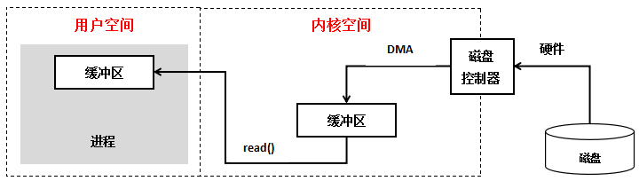
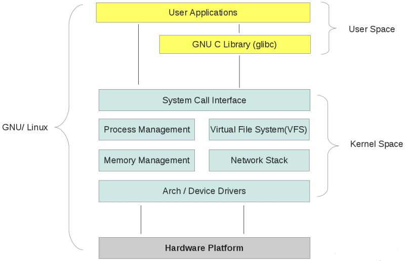

### 概念

我们都知道unix世界里、一切皆文件、而文件是什么呢？文件就是一串二进制流而已、不管socket、还是FIFO、管道、终端、对我们来说、一切都是文件、一切都是流、在信息交换的过程中、我们都是对这些流进行数据的收发操作、简称为I/O操作(input and output)、往流中读出数据、系统调用read、写入数据、系统调用write、不过话说回来了、计算机里有这么多的流、我怎么知道要操作哪个流呢？做到这个的就是文件描述符、即通常所说的fd、一个fd就是一个整数、所以对这个整数的操作、就是对这个文件（流）的操作、我们创建一个socket、通过系统调用会返回一个文件描述符、那么剩下对socket的操作就会转化为对这个描述符的操作、不能不说这又是一种分层和抽象的思想。

### IO交互

通常用户进程中的一个完整IO分为两个阶段：



 用户空间<------------->内核空间

 内核空间<------------->设备空间



内核空间中存放的是内核代码和数据，而进程的用户空间中存放的是用户程序的代码和数据。不管是内核空间还是用户空间，它们都处于虚拟空间中，Linux使用两级保护机制：0级供内核使用、3级供用户程序使用。

操作系统和驱动程序运行在内核空间，应用程序运行在用户空间，两者不能简单地使用指针传递数据。因为Linux使用的虚拟内存机制，其必须通过系统调用请求kernel来协助完成IO动作。内核会为每个IO设备维护一个缓冲区，用户空间的数据可能被换出。当内核空间使用用户空间指针时，对应的数据可能不在内存中。

对于一个输入操作来说，进程IO系统调用后，内核会先看缓冲区中有没有相应的缓存数据，没有的话再到设备中读取。因为设备IO一般速度较慢，需要等待，内核缓冲区有数据则直接复制到进程空间。

对于一个网络输入操作通常包括两个不同阶段：

1. 等待网络数据到达网卡 –&gt; 读取到内核缓冲区
2. 从内核缓冲区复制数据 –&gt; 用户空间

IO有内存IO、网络IO和磁盘IO三种、通常我们说的IO指的是后两者。

### IO模型


#### 阻塞IO

同步阻塞IO模型是最简单的IO模型，用户线程在内核进行IO操作时被阻塞


用户线程通过系统调用read发起IO读操作，由用户空间转到内核空间。内核等到数据包到达后，然后将接收的数据拷贝到用户空间，完成read操作。

用户线程使用同步阻塞IO模型的伪代码描述为：

```c
{
    ...
    read(socket, buffer);
    process(buffer);
    ...
}
```

即用户需要等待read将socket中的数据读取到buffer后，才继续处理接收的数据。**整个IO请求的过程中，用户线程是被阻塞的，这导致用户在发起IO请求时，不能做任何事情，对CPU的资源利用率不够**。

#### 非阻塞IO

同步非阻塞IO是在同步阻塞IO的基础上，将socket设置为NONBLOCK。这样做用户线程可以在发起IO请求后可以立即返回。


由于socket是非阻塞的方式，因此用户线程发起IO请求时立即返回。但并未读取到任何数据，用户线程需要不断地发起IO请求，直到数据到达后，才真正读取到数据，继续执行。

用户线程使用同步非阻塞IO模型的伪代码描述为：

```c
{
    while(read(socket, buffer) != SUCCESS){
        // 轮询等待
    }
    process(buffer);
}
```

即用户需要不断地调用read，尝试读取socket中的数据，直到读取成功后，才继续处理接收的数据。整个IO请求的过程中，虽然用户线程每次发起IO请求后可以立即返回，但是为了等到数据，仍需要不断地轮询、重复请求，消耗了大量的CPU的资源。**一般很少直接使用这种模型，而是在其他IO模型中使用非阻塞IO这一特性**。

#### IO多路复用

IO多路复用模型是建立在内核提供的多路分离函数select基础之上的，使用select函数可以避免同步非阻塞IO模型中轮询等待的问题。多路复用是指使用一个线程来检查多个文件描述符（Socket）的就绪状态，比如调用select和poll函数，传入多个文件描述符，如果有一个文件描述符就绪，则返回，否则阻塞直到超时。得到就绪状态后进行真正的操作可以在同一个线程里执行，也可以启动线程执行（比如使用线程池）。


用户首先将需要进行IO操作的socket添加到select中，然后**阻塞地等待select系统调用返回**。当数据到达时，socket被激活，select函数返回。用户线程正式发起read请求，读取数据并继续执行。

从流程上来看，使用select函数进行IO请求和同步阻塞模型没有太大的区别，甚至还多了添加监视socket，以及调用select函数的额外操作，效率更差。但是，使用select以后最大的优势是用户可以在一个线程内同时处理多个socket的IO请求。用户可以注册多个socket，然后不断地调用select读取被激活的socket，即可达到在**同一个线程内同时处理多个IO请求的目的**。而在同步阻塞模型中，必须通过多线程的方式才能达到这个目的。

用户线程使用select函数的伪代码描述为：

```c
{
    select(socket);
    while(1){
        sockets = select();
        for(socket in sockets) {
            if(can_read(socket)) {
                read(socket, buffer);
                process(buffer);
            }else if(can_write(socket)){
                write(socket, buffer);
                process(buffer);
            }else{
                // ....
            }
        }
    }
}
```


#### 信号驱动IO

使用信号，让内核在文件描述符就绪的时候使用 SIGIO 信号来通知我们。我们将这种模式称为信号驱动 I/O 模式。


允许Socket使用信号驱动 I/O ，还要注册一个 SIGIO 的处理函数，这时的系统调用将会立即返回。然后我们的程序可以继续做其他的事情，当数据就绪时，进程收到系统发送一个 SIGIO 信号，可以在信号处理函数中调用IO操作函数处理数据。

由于信号驱动IO在实际中并不常用，在此不做具体分析。

#### 异步IO

当应用程序调用aio_read时，内核一方面去取数据报内容返回，另一方面将程序控制权还给应用进程，应用进程继续处理其他事情，是一种非阻塞的状态。

当内核中有数据报就绪时，由内核将数据报拷贝到应用程序中，返回aio_read中定义好的函数处理程序。


