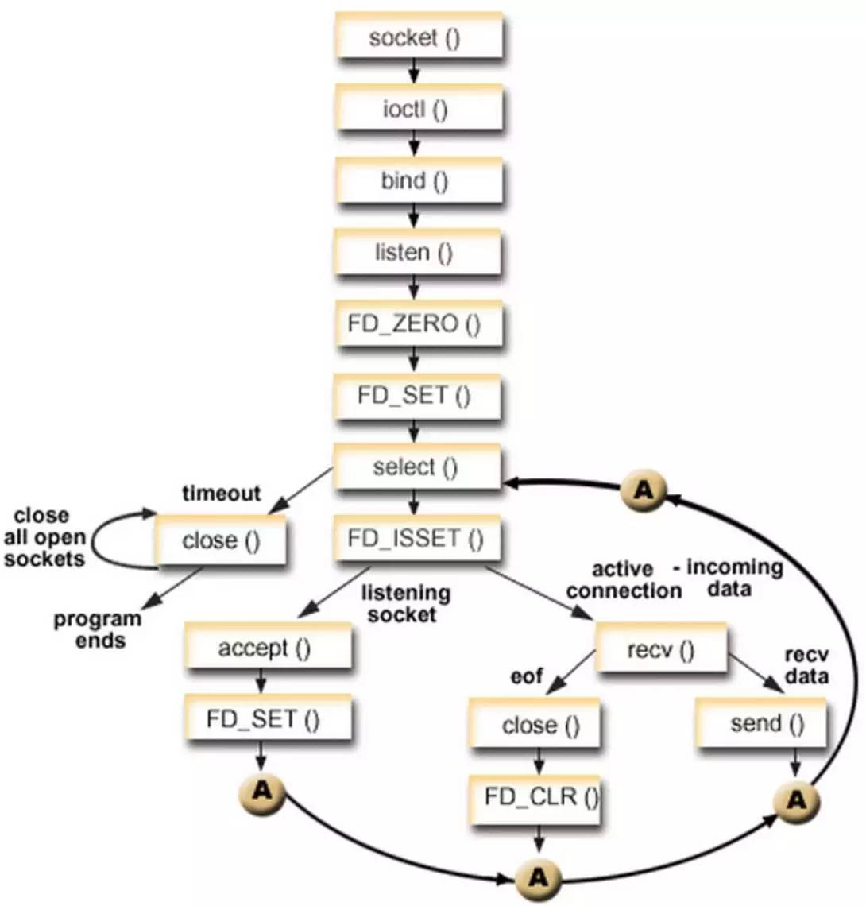

## IO多路复用

### 概念

**单个线程，通过记录跟踪每个I/O流(sock)的状态，来同时管理多个I/O流**

其实“I/O多路复用”这个坑爹翻译可能是这个概念在中文里面如此难理解的原因。所谓的I/O多路复用在英文中其实叫 I/O multiplexing. 如果你搜索multiplexing啥意思，基本上都会出这个图：

*于是大部分人都直接联想到"一根网线，多个sock复用" 这个概念，包括上面的几个回答， 其实不管你用多进程还是I/O多路复用， 网线都只有一根好伐。**多个Sock复用一根网线这个功能是在内核＋驱动层实现的**。*

**重要的事情再说一遍： I/O multiplexing 这里面的 multiplexing 指的其实是在单个线程通过记录跟踪每一个Sock(I/O流)的状态(来同时管理多个I/O流**. 发明它的原因，是尽量多的提高服务器的吞吐能力。

在同一个线程里面， 通过拨开关的方式，来同时传输多个I/O流。

### select 

> select 函数监视的文件描述符分3类，分别是writefds、readfds、和exceptfds。调用后select函数会阻塞，直到有描述符就绪（有数据 可读、可写、或者有except），或者超时（timeout指定等待时间，如果立即返回设为null即可），函数返回。当select函数返回后，可以通过遍历fdset，来找到就绪的描述符。

单个进程就可以同时处理多个网络连接的io请求（同时阻塞多个io操作）。基本原理就是程序呼叫select，然后整个程序就阻塞状态，这时候，kernel内核就会轮询检查所有select负责的文件描述符fd，当找到其中那个的数据准备好了文件描述符，会返回给select，select通知系统调用，将数据从kernel内核复制到进程缓冲区(用户空间)。

select目前几乎在所有的平台上支持，其良好跨平台支持也是它的一个优点。select的一个缺点在于单个进程能够监视的文件描述符的数量存在最大限制，在Linux上一般为1024，可以通过修改宏定义甚至重新编译内核的方式提升这一限制，但是这样也会造成效率的降低。

select本质上是通过设置或者检查存放fd标志位的数据结构来进行下一步处理。

#### 缺点

* select最大的缺陷就是单个进程所打开的FD是有一定限制的，它由FD_SETSIZE设置，默认值是1024。
* 对socket进行扫描时是线性扫描，即采用轮询的方法，效率较低。
* 需要维护一个用来存放大量fd的数据结构，这样会使得用户空间和内核空间在传递该结构时复制开销大。

### poll

>poll本质上和select没有区别，它将用户传入的数组拷贝到内核空间，然后查询每个fd对应的设备状态，如果设备就绪则在设备等待队列中加入一项并继续遍历，如果遍历完所有fd后没有发现就绪设备，则挂起当前进程，直到设备就绪或者主动超时，被唤醒后它又要再次遍历fd。这个过程经历了多次无谓的遍历。

poll的原理与select非常相似，差别如下:

* 描述fd集合的方式不同，poll使用 pollfd 结构而不是select结构fd_set结构，所以poll是链式的，没有最大连接数的限制。
* poll有一个特点是水平触发，也就是通知程序fd就绪后，这次没有被处理，那么下次poll的时候会再次通知同个fd已经就绪。

#### 缺点：

* 大量的fd的数组被整体复制于用户态和内核地址空间之间，而不管这样的复制是不是有意义。
* poll还有一个特点是“水平触发”，如果报告了fd后，没有被处理，那么下次poll时会再次报告该fd。

**注意：**从上面看，select和poll都需要在返回后，通过遍历文件描述符来获取已经就绪的socket。事实上，同时连接的大量客户端在一时刻可能只有很少的处于就绪状态，因此随着监视的描述符数量的增长，其效率也会线性下降。

### epoll

> epoll支持水平触发和边缘触发，最大的特点在于边缘触发，它只告诉进程哪些fd刚刚变为就绪态，并且只会通知一次。还有一个特点是，epoll使用“事件”的就绪通知方式，通过epoll_ctl注册fd，一旦该fd就绪，内核就会采用类似callback的回调机制来激活该fd，epoll_wait便可以收到通知。

相对于select和poll来说，epoll更加灵活，没有描述符限制。epoll使用一个文件描述符管理多个描述符，将用户关系的文件描述符的事件存放到内核的一个事件表中，这样在用户空间和内核空间的copy只需一次。

**水平触发：**

* socket接收缓冲区不为空，有数据可读，读事件一直触发。
* socket发送缓冲区不满，可以继续写入数据，写事件一直触发。

**边缘触发：**

* socket的接收缓冲区状态变化时触发读事件，即空的接收缓冲区刚接收到数据时触发读事件
* socket的发送缓冲区状态变化时触发写事件，即满的缓冲区刚空出空间时触发读事件

**边沿触发仅触发一次，水平触发会一直触发。**

