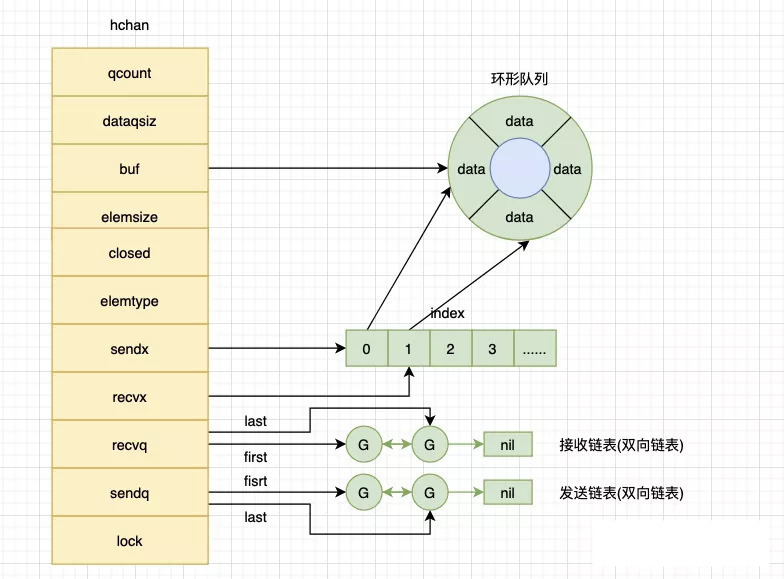

## channel

### 基本设计思想

`channel`设计的基本思想是：**不要通过共享内存来通信，而是通过通信来实现共享内存（Do not communicate by sharing memory; instead, share memory by communicating）**。

>什么是使用共享内存来通信？其实就是多个线程/协程使用同一块内存，通过加锁的方式来宣布使用某块内存，通过解锁来宣布不再使用某块内存。
>
>什么是通过通信来实现共享内存？其实就是把一份内存的开销变成两份内存开销而已，再说的通俗一点就是，我们使用发送消息的方式来同步信息。
>
>为什么鼓励使用通过通信来实现共享内存？使用发送消息来同步信息相比于直接使用共享内存和互斥锁是一种更高级的抽象，使用更高级的抽象能够为我们在程序设计上提供更好的封装，让程序的逻辑更加清晰；其次，消息发送在解耦方面与共享内存相比也有一定优势，我们可以将线程的职责分成生产者和消费者，并通过消息传递的方式将它们解耦，不需要再依赖共享内存。

`channel`在设计上本质就是一个有锁的环形队列，包括发送方队列、接收方队列、互斥锁等结构，下面我就一起从源码出发，剖析这个有锁的环形队列是怎么设计的！

### 特性预览

#### 初始化

声明和初始化管道的方式主要有两种：

- 变量声明
- 使用内置函数make()

##### 变量声明

```golang
var ch chan int // 声明管道
```

 这种方式申明的管道，值为nil。每个管道只能存储一种类型的数据。

##### 使用内置函数make()

使用内置函数make()可以创建无缓冲管道和带缓冲管道

```golang
ch1 := make(chan string)      // 无缓冲管道
ch2 := make(chan string, 5)   // 带缓冲管道
```

#### 管道操作

##### 操作符

操作符`<-` 表示数据流向，管道在左表示向管道写入数据，管道在右表示从管道读数据，如下所示：

```golang
package main

import "fmt"

func main() {
	ch := make(chan int, 10)
	ch <- 1     // 数据流入管道
	d := <-ch   // 数据流出管道
	fmt.Println(d)
}
```

默认的管道为双向可读写，管道在函数间传递时可以使用操作符限制管道的读写，如下：

```golang
func ChanParamRW(ch chan int) {
	// 管道可读写
}

func ChanParamR(ch <-chan int) {
	// 只能从管道读取数据
}

func ChanParamW(ch chan<- int) {
	// 只能向管道写入数据
}
```

##### 数据读写

管道没有缓冲区时，从管道读取数据会阻塞，直到有协程向管道中写入数据。类似地，向管道写入数据也会阻塞，直达有协程从管道读取数据。

管道有缓冲区但缓冲区没有数据时，从管道读取数据也会阻塞，直到有协程写入数据。类似地，向管道写入数据时，如果缓冲区已满，那么也会阻塞，直到有协程从缓冲区中读出数据。

对于值为nil的管道，无论读写都会阻塞，而且是永久阻塞。

使用内置函数close()可以关闭管道，尝试向关闭的管道写入数据会触发panic，但关闭的管道仍可读。

管道读取表达式最多可以给两个变量赋值：

```golang
v1 := <- chan
x, ok := <- chan
```

第一个变量表示读出的数据，第二个变量（bool类型）表示是否成功读取了数据，需要注意的是，第二个变量不用于指示管道的关闭状态。

第二个变量常常会被错误地理解成管道的关闭状态，那是因为它的值确实跟管道的关闭状态有关，更确切地说跟管道缓冲区中是否有数据有关。

一个已关闭的管道有两种情况：

- 管道缓冲区已没有数据
- 管道缓冲区还有数据

对于第一种情况，管道已关闭且缓冲区中没有数据，那么管道读取表达式返回的第一个变量为相应类型的零值，第二个变量为false。

对于第二种情况，管道已关闭但缓冲区仍有数据，那么管道读取表达式返回的第一个变量为读取到的数据，第二个变量为true。可以看到，只有管道已关闭且缓冲区中没有数据时，管道读取表达式返回的第二个值才跟管道关闭状态一致。

#### 小结

内置函数len()和cấp() 作用于管道，分别用于查询缓冲区中数据的个数及缓冲区的大小。

管道实现了一种**FIFO**（先进先出）的队列，数据总是按照写入的顺序流出管道。

协程读取管道时，阻塞条件有：

- 管道无缓冲区
- 管道的缓冲区无数据
- 管道的值为nil

协程写入管道时，阻塞的条件有：

- 管道无缓冲区
- 管道缓冲区已满
- 管道的值为nil

### 实现原理

#### 数据结构

源码包中`src/runtime/chan.go:hchan`定义了管道色数据结构

```golang
type hchan struct {
	qcount   uint           // total data in the queue（当前队列剩余的元素个数）
	dataqsiz uint           // size of the circular queue（环形队列长度，即可以存放的元素个数）
	buf      unsafe.Pointer // points to an array of dataqsiz elements（环形队列指针）
	elemsize uint16 // 每个元素的大小
	closed   uint32 // 标识关闭状态
  elemtype *_type // element type（元素类型）
	sendx    uint   // send index（队列下标，指示元素写入时存放到队列中的位置）
	recvx    uint   // receive index（队列下标，指示下一个被读取的元素在队列中的位置）
	recvq    waitq  // list of recv waiters（等待读消息的协程队列）
	sendq    waitq  // list of send waiters（等待写消息的协程队列）

	// lock protects all fields in hchan, as well as several
	// fields in sudogs blocked on this channel.
	//
	// Do not change another G's status while holding this lock
	// (in particular, do not ready a G), as this can deadlock
	// with stack shrinking.
	lock mutex // 互斥锁，chan不允许并发读写
}

```

从数据结构中可以看出管道由队列、类型信息、协程等待队列组成。

- `buf`是指向底层的循环数组，`dataqsiz`就是这个循环数组的长度，`qcount`就是当前循环数组中的元素数量，缓冲的`channel`才有效。
- `elemsize`和`elemtype`就是我们创建`channel`时设置的容量大小和元素类型。
- `sendq`、`recvq`是一个双向链表结构，分别表示被阻塞的`goroutine`链表，这些 goroutine 由于尝试读取 `channel` 或向 `channel` 发送数据而被阻塞。

对于上面的描述，我们可以画出来这样的一个理解图：

