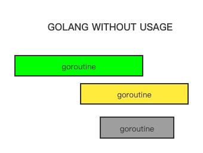
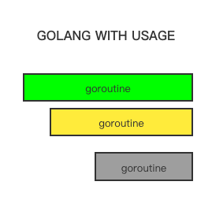

## Context

### 产生背景

Go 1.7 标准库引入 context，中文译作“上下文”，准确说它是 goroutine 的上下文，包含 goroutine 的运行状态、环境、现场等信息。

context 主要用来在 goroutine 之间传递上下文信息，包括：取消信号、超时时间、截止时间、k-v 等。

随着 context 包的引入，标准库中很多接口因此加上了 context 参数，例如 database/sql 包。context 几乎成为了并发控制和超时控制的标准做法。

> context.Context 类型的值可以协调多个 groutine 中的代码执行“取消”操作，并且可以存储键值对。最重要的是它是并发安全的。
> 与它协作的 API 都可以由外部控制执行“取消”操作，例如：取消一个 HTTP 请求的执行。

###   概述

Go 语言中的每一个请求的都是通过一个单独的 Goroutine 进行处理的，HTTP/RPC 请求的处理器往往都会启动新的 Goroutine 访问数据库和 RPC 服务，我们可能会创建多个 Goroutine 来处理一次请求，而 `Context` 的主要作用就是在不同的 Goroutine 之间同步请求特定的数据、取消信号以及处理请求的截止日期。

 

每一个 `Context` 都会从最顶层的 Goroutine 一层一层传递到最下层，这也是 Golang 中上下文最常见的使用方式，如果没有 `Context`，当上层执行的操作出现错误时，下层其实不会收到错误而是会继续执行下去。
 

当最上层的 Goroutine 因为某些原因执行失败时，下两层的 Goroutine 由于没有接收到这个信号所以会继续工作；但是当我们正确地使用 `Context` 时，就可以在下层及时停掉无用的工作减少额外资源的消耗：
 

这其实就是 Golang 中上下文的最大作用，在不同 Goroutine 之间对信号进行同步避免对计算资源的浪费，与此同时 `Context` 还能携带以请求为作用域的键值对信息。

### 接口

`Context` 其实是 Go 语言 `context` 包对外暴露的接口，该接口定义了四个需要实现的方法，其中包括：

1. `Deadline` 方法需要返回当前 `Context` 被取消的时间，也就是完成工作的截止日期；
2. `Done` 方法需要返回一个 Channel，这个 Channel 会在当前工作完成或者上下文被取消之后关闭，多次调用 `Done` 方法会返回同一个 Channel；
3. `Err` 方法会返回当前 `Context` 结束的原因，它只会在 `Done` 返回的 Channel 被关闭时才会返回非空的值；
   1. 如果当前 `Context` 被取消就会返回 `Canceled` 错误；
   2. 如果当前 `Context` 超时就会返回 `DeadlineExceeded` 错误；
4. `Value` 方法会从 `Context` 中返回键对应的值，对于同一个上下文来说，多次调用 `Value` 并传入相同的 `Key` 会返回相同的结果，这个功能可以用来传递请求特定的数据；

```go
type Context interface {
    Deadline() (deadline time.Time, ok bool)
    Done() <-chan struct{}
    Err() error
    Value(key interface{}) interface{}
}
```

`context` 包中提供的 `Background`、`TODO`、`WithDeadline` 等方法就会返回实现该接口的私有结构体的，我们会在后面的小节中详细介绍它们的工作原理。

###  示例

我们可以通过一个例子简单了解一下 `Context` 是如何对信号进行同步的，在这段代码中我们创建了一个过期时间为 `1s` 的上下文，并将上下文传入 `handle` 方法，该方法会使用 `500ms` 的时间处理该『请求』：

```go
package main

import (
	"context"
	"fmt"
	"time"
)

func handle(ctx context.Context, duration time.Duration) {
	select {
	case <-ctx.Done():
		fmt.Println("handel", ctx.Err())
	case <-time.After(duration):
		fmt.Println("process request with ", duration)
	}
}

func main() {
	ctx, cancel := context.WithTimeout(context.Background(), 1*time.Second)
	defer cancel()
	go handle(ctx, 500*time.Millisecond)
	select {
	case <-ctx.Done():
		fmt.Println("main", ctx.Err())
	}
}

```

所以我们有足够的时间处理该『请求』，而运行上述代码时会打印出如下所示的内容：

```bash
$ go run context.go
process request with 500ms
main context deadline exceeded
```

『请求』被 Goroutine 正常处理没有进入超时的 `select` 分支，但是在 `main` 函数中的 `select` 却会等待 `Context` 的超时最终打印出 `main context deadline exceeded`，如果我们将处理『请求』的时间改成 `1500ms`，当前处理的过程就会因为 `Context` 到截止日期而被中止：

```bash
$ go run context.go
main context deadline exceeded
handle context deadline exceeded
```

两个函数都会因为 `ctx.Done()` 返回的管道被关闭而中止，也就是上下文超时。

多个 Goroutine 同时订阅 `ctx.Done()` 管道中的消息，一旦接收到取消信号就停止当前正在执行的工作并提前返回。

###  实现原理

`Context` 相关的源代码都在 context.go 这个文件中，在这一节中我们就会从 Go 语言的源代码出发介绍 `Context` 的实现原理，包括如何在多个 Goroutine 之间同步信号、为请求设置截止日期并传递参数和信息。

### 默认上下文

在 `context` 包中，最常使用其实还是 `context.Background` 和 `context.TODO` 两个方法，这两个方法最终都会返回一个预先初始化好的私有变量 `background` 和 `todo`：

```go
func Background() Context {
    return background
}

func TODO() Context {
    return todo
}
```

这两个变量是在包初始化时就被创建好的，它们都是通过 `new(emptyCtx)` 表达式初始化的指向私有结构体 `emptyCtx` 的指针，这是包中最简单也是最常用的类型：

```go
type emptyCtx int

func (*emptyCtx) Deadline() (deadline time.Time, ok bool) {
    return
}

func (*emptyCtx) Done() <-chan struct{} {
    return nil
}

func (*emptyCtx) Err() error {
    return nil
}

func (*emptyCtx) Value(key interface{}) interface{} {
    return nil
}

```

它对 `Context` 接口方法的实现也都非常简单，无论何时调用都会返回 `nil` 或者空值，并没有任何特殊的功能，`Background` 和 `TODO` 方法在某种层面上看其实也只是互为别名，两者没有太大的差别，不过 `context.Background()` 是上下文中最顶层的默认值，所有其他的上下文都应该从 `context.Background()` 演化出来。

我们应该只在不确定时使用 `context.TODO()`，在多数情况下如果函数没有上下文作为入参，我们往往都会使用 `context.Background()` 作为起始的 `Context` 向下传递。

### 取消信号

`WithCancel` 方法能够从 `Context` 中创建出一个新的子上下文，同时还会返回用于取消该上下文的函数，也就是 `CancelFunc`，我们直接从 `WithCancel` 函数的实现来看它到底做了什么：

```go
func WithCancel(parent Context) (ctx Context, cancel CancelFunc) {
    c := newCancelCtx(parent)
    propagateCancel(parent, &c)
    return &c, func() { c.cancel(true, Canceled) }
}
```

`newCancelCtx` 是包中的私有方法，它将传入的父上下文包到私有结构体 `cancelCtx{Context: parent}` 中，`cancelCtx` 就是当前函数最终会返回的结构体类型，我们在详细了解它是如何实现接口之前，先来了解一下用于传递取消信号的 `propagateCancel` 函数：

```go
func propagateCancel(parent Context, child canceler) {
    if parent.Done() == nil {
        return // parent is never canceled
    }
    if p, ok := parentCancelCtx(parent); ok {
        p.mu.Lock()
        if p.err != nil {
            child.cancel(false, p.err)
        } else {
            if p.children == nil {
                p.children = make(map[canceler]struct{})
            }
            p.children[child] = struct{}{}
        }
        p.mu.Unlock()
    } else {
        go func() {
            select {
            case <-parent.Done():
                child.cancel(false, parent.Err())
            case <-child.Done():
            }
        }()
    }
}
```

该函数总共会处理与父上下文相关的三种不同的情况：

1. 当 `parent.Done() == nil`，也就是 `parent` 不会触发取消事件时，当前函数直接返回；
2. 当 `child` 的继承链上有 `parent` 是可以取消的上下文时，就会判断 `parent` 是否已经触发了取消信号；
   - 如果已经被取消，当前 `child` 就会立刻被取消；
   - 如果没有被取消，当前 `child` 就会被加入 `parent` 的 `children` 列表中，等待 `parent` 释放取消信号；
3. 遇到其他情况就会开启一个新的 Goroutine，同时监听 `parent.Done()` 和 `child.Done()` 两个管道并在前者结束后立刻调用 `child.cancel` 取消子上下文；

这个函数的主要作用就是在 `parent` 和 `child` 之间同步取消和结束的信号，保证在 `parent` 被取消时，`child` 也会收到对应的信号，不会发生状态不一致的问题。

`cancelCtx` 实现的几个接口方法其实没有太多值得介绍的地方，该结构体最重要的方法其实是 `cancel` 方法，这个方法会关闭上下文的管道并向所有的子上下文发送取消信号：

```go
func (c *cancelCtx) cancel(removeFromParent bool, err error) {
    c.mu.Lock()
    if c.err != nil {
        c.mu.Unlock()
        return
    }
    c.err = err
    if c.done == nil {
        c.done = closedchan
    } else {
        close(c.done)
    }
    for child := range c.children {
        child.cancel(false, err)
    }
    c.children = nil
    c.mu.Unlock()

    if removeFromParent {
        removeChild(c.Context, c)
    }
}
```

除了 `WithCancel` 之外，`context` 包中的另外两个函数 `WithDeadline` 和 `WithTimeout` 也都能创建可以被取消的上下文，`WithTimeout` 只是 `context` 包为我们提供的便利方法，能让我们更方便地创建 `timerCtx`：

```go
func WithTimeout(parent Context, timeout time.Duration) (Context, CancelFunc) {
    return WithDeadline(parent, time.Now().Add(timeout))
}

func WithDeadline(parent Context, d time.Time) (Context, CancelFunc) {
    if cur, ok := parent.Deadline(); ok && cur.Before(d) {
        return WithCancel(parent)
    }
    c := &timerCtx{
        cancelCtx: newCancelCtx(parent),
        deadline:  d,
    }
    propagateCancel(parent, c)
    dur := time.Until(d)
    if dur <= 0 {
        c.cancel(true, DeadlineExceeded) // deadline has already passed
        return c, func() { c.cancel(false, Canceled) }
    }
    c.mu.Lock()
    defer c.mu.Unlock()
    if c.err == nil {
        c.timer = time.AfterFunc(dur, func() {
            c.cancel(true, DeadlineExceeded)
        })
    }
    return c, func() { c.cancel(true, Canceled) }
}

```

`WithDeadline` 方法在创建 `timerCtx` 上下文的过程中，判断了上下文的截止日期与当前日期，并通过 `time.AfterFunc` 方法创建了定时器，当时间超过了截止日期之后就会调用 `cancel` 方法同步取消信号。

`timerCtx` 结构体内部嵌入了一个 `cancelCtx` 结构体，也『继承』了相关的变量和方法，除此之外，持有的定时器和 `timer` 和截止时间 `deadline` 也实现了定时取消这一功能：

```go
type timerCtx struct {
    cancelCtx
    timer *time.Timer // Under cancelCtx.mu.

    deadline time.Time
}

func (c *timerCtx) Deadline() (deadline time.Time, ok bool) {
    return c.deadline, true
}

func (c *timerCtx) cancel(removeFromParent bool, err error) {
    c.cancelCtx.cancel(false, err)
    if removeFromParent {
        removeChild(c.cancelCtx.Context, c)
    }
    c.mu.Lock()
    if c.timer != nil {
        c.timer.Stop()
        c.timer = nil
    }
    c.mu.Unlock()
}
```

`cancel` 方法不仅调用了内部嵌入的 `cancelCtx.cancel`，还会停止持有的定时器减少不必要的资源浪费。

### 传值方法

在最后我们需要了解一下如何使用上下文传值，`context` 包中的 `WithValue` 函数能从父上下文中创建一个子上下文，传值的子上下文使用私有结构体 `valueCtx` 类型：

```go
func WithValue(parent Context, key, val interface{}) Context {
    if key == nil {
        panic("nil key")
    }
    if !reflectlite.TypeOf(key).Comparable() {
        panic("key is not comparable")
    }
    return &valueCtx{parent, key, val}
}

```

`valueCtx` 函数会将除了 `Value` 之外的 `Err`、`Deadline` 等方法代理到父上下文中，只会处理 `Value` 方法的调用，然而每一个 `valueCtx` 内部也并没有存储一个键值对的哈希，而是只包含一个键值对：

```go
type valueCtx struct {
    Context
    key, val interface{}
}

func (c *valueCtx) Value(key interface{}) interface{} {
    if c.key == key {
        return c.val
    }
    return c.Context.Value(key)
}
```

如果当前 `valueCtx` 中存储的键与 `Value` 方法中传入的不匹配，就会从父上下文中查找该键对应的值直到在某个父上下文中返回 `nil` 或者查找到对应的值。

###  总结

Go 语言中的 `Context` 的主要作用还是在多个 Goroutine 或者模块之间同步取消信号或者截止日期，用于减少对资源的消耗和长时间占用，避免资源浪费，虽然传值也是它的功能之一，但是这个功能我们还是很少用到。

在真正使用传值的功能时我们也应该非常谨慎，不能将请求的所有参数都使用 `Context` 进行传递，这是一种非常差的设计，比较常见的使用场景是传递请求对应用户的认证令牌以及用于进行分布式追踪的请求 ID。

