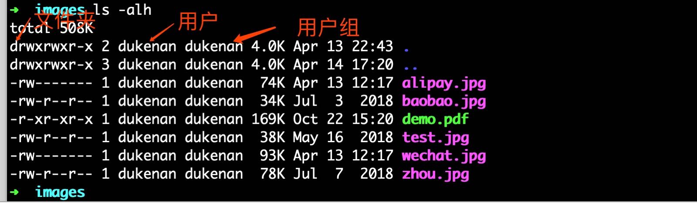

#   Linux之文件权限

## 查看权限

```shell
$ ls -alh
```



一共有十位数，其中：最前面那个 - 代表的是类型，
**中间那三个 rw- 代表的是所有者（user）拥有的权限**
**然后那三个 r-- 代表的是组群（group）拥有的权限**
**最后那三个 r-- 代表的是其他人（other）拥有的权限**

- r (4)：表示文件可以被读（read）
- w(2) ：表示文件可以被写（write）
- x(1)：表示文件可以被执行（如果它是程序的话）

## 修改权限

```shell
$ chmod [-cfvR]  [--help]  [--version] mode file...
```

 其中：

- u 表示该文件的拥有者，g 表示与该文件的拥有者属于同一个群体(group)者，o 表示其他以外的人，a 表示这三者皆是。
- + 表示增加权限、- 表示取消权限、= 表示唯一设定权限。
- r 表示可读取，w 表示可写入，x 表示可执行，X 表示只有当该文件是个子目录或者该文件已经被设定过为可执行。

其他参数说明：

*   -c : 若该文件权限确实已经更改，才显示其更改动作
*   -f : 若该文件权限无法被更改也不要显示错误讯息
*   -v : 显示权限变更的详细资料
*   -R : 对目前目录下的所有文件与子目录进行相同的权限变更(即以递回的方式逐个变更)
*   --help : 显示辅助说明
*   --version : 显示版本

##  实例

将文件 file1.txt 设为所有人皆可读取 :
```shell
$ chmod ugo+r file1.txt
```

将文件 file1.txt 设为所有人皆可读取 :

```shell
$ chmod a+r file1.txt
```

将文件 file1.txt 与 file2.txt 设为该文件拥有者，与其所属同一个群体者可写入，但其他以外的人则不可写入 :

```shell
$ chmod ug+w,o-w file1.txt file2.txt
```

将 ex1.py 设定为只有该文件拥有者可以执行 :

```shell
$ chmod u+x ex1.py
```

将目前目录下的所有文件与子目录皆设为任何人可读取 :

```shell
$ chmod -R a+r *
```

此外chmod也可以用数字来表示权限如 :

```shell
$ chmod 777 file
```


## 修改所属

实例1：

修改文件所属的用户及用户组：

```shell
# chown dukenan:dukenan abc.txt
```

实例2：  

修改文件夹所属用户及用户组：

```shell
# chown -R dukenan:dukenan ./docs/
```


