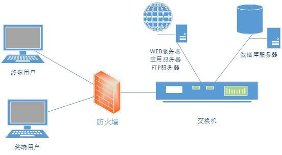

## Centos7防火墙配置

Linux具有较强的安全性控制，与其本身的安全策略和防火墙控制是分不开的。提起Linux的安全，就不得不说到Linux安全的重要组成部件：selinux、firewall、iptables。在centos7中firewall取代了iptables，在此之前则主要是通过iptables来控制。





### 查看firewall服务状态

```bash
# systemctl status firewalld
```

```bash
[root@localhost ~]# systemctl status firewalld
● firewalld.service - firewalld - dynamic firewall daemon
   Loaded: loaded (/usr/lib/systemd/system/firewalld.service; enabled; vendor preset: enabled)
   Active: inactive (dead) since Fri 2020-06-19 17:25:48 CST; 3s ago
     Docs: man:firewalld(1)
  Process: 28882 ExecStart=/usr/sbin/firewalld --nofork --nopid $FIREWALLD_ARGS (code=exited, status=0/SUCCESS)
 Main PID: 28882 (code=exited, status=0/SUCCESS)
```

### 解锁firewall

```bash
# 锁定firewall
systemctl mask firewalld

# 解锁firewall
systemctl unmask firewalld
```


### 查看firewall的状态

```bash
# firewall-cmd --state
```

```bash
[root@localhost ~]# firewall-cmd --state
not running
```

### 开启、重启、关闭、firewalld.service服务

```bash
# systemctl start|stop|restart firewalld
```

### 查看防火墙规则

```bash
# firewall-cmd --list-all 
```

```bash
[root@localhost ~]# firewall-cmd --list-all 
public (active)
  target: default
  icmp-block-inversion: no
  interfaces: enp2s0
  sources: 
  services: dhcpv6-client ssh
  ports: 3306/tcp
  protocols: 
  masquerade: no
  forward-ports: 
  source-ports: 
  icmp-blocks: 
  rich rules: 
```

### 操作端口

```bash
# 查询端口是否开放
firewall-cmd --query-port=8080/tcp

# 开放80端口
firewall-cmd --permanent --add-port=80/tcp

# 移除端口
firewall-cmd --permanent --remove-port=8080/tcp

#重启防火墙(修改配置后要重启防火墙)
firewall-cmd --reload

# 参数解释
1、firwall-cmd：是Linux提供的操作firewall的一个工具；
2、--permanent：表示设置为持久；
3、--add-port：标识添加的端口； 
```

