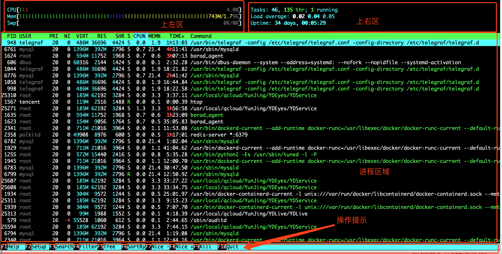

#  Htop命令


## htop使用

```shell
$ htop
```

</img>

在这张图我们可以看出来大致分为了四个区域：

- 上左区：CPU使用率、内存以及交换空间使用率；
- 上右区：1/5/15分钟的平均负载以及开机时间等；
- 进程区域：当前系统中运行的进程；
- 操作提示：功能键；


## 数据展示

| 参数  | 解释                                                         |
| :---- | ------------------------------------------------------------ |
| PID   | 进程标志号，是非零正整数                                     |
| USER  | 进程所有者的用户名                                           |
| PR    | 进程的优先级别                                               |
| NI    | 进程的优先级别数值                                           |
| VIRT  | 进程占用的虚拟内存值                                         |
| RES   | 进程占用的物理内存值                                         |
| SHR   | 进程使用的共享内存值                                         |
| S     | 进程的状态，其中S代表休眠，R代表正在运行，Z表示僵死状态，N代表该进程优先级是负数 |
| %CPU | 该进程占用的cpu使用率                                        |
| %MEM | 该进程占用的物理内存和总内存的百分比                         |
| TIME+ | 该进程启动后占用的总的CPU时间                                |
| COMMAND | 进程启动的启动命令名称                                |

下面是 F1~F10 的功能和对应的字母快捷键：


| **Shortcut Key** | **Function Key** | **Description**               | **中文说明**                                 |
| ---------------- | ---------------- | ----------------------------- | :------------------------------------------- |
| h, ?             | F1               | Invoke htop Help              | 查看htop使用说明                             |
| S                | F2               | Htop Setup Menu               | htop 设定                                    |
| /                | F3               | Search for a Process          | 搜索进程                                     |
| \                | F4               | Incremental process filtering | 增量进程过滤器                               |
| t                | F5               | Tree View                     | 显示树形结构                                 |
| <, >             | F6               | Sort by a column              | 选择排序方式                                 |
| [                | F7               | Nice - (change priority)      | 可减少nice值，这样就可以提高对应进程的优先级 |
| ]                | F8               | Nice + (change priority)      | 可增加nice值，这样就可以降低对应进程的优先级 |
| k                | F9               | Kill a Process                | 可对进程传递信号                             |
| q                | F10              | Quit htop                     | 结束htop                                     |


## 命令行选项

|   **选项**   |  **说明**    |
| ---- | ---- |
|-C --no-color              | 使用一个单色的配色方案 |
|-d --delay=DELAY           | 设置延迟更新时间，单位秒 |
|-h --help                  | 显示htop 命令帮助信息 |
|-s --sort-key=COLUMN       | 依此列来排序 |
|-t --tree                  | 默认显示树视图 |
|-u --user=USERNAME         | 只显示一个给定的用户的过程 |
|-p --pid=PID,[,PID,PID...] | 只显示给定的PIDs |
|-v --version               | 显示版本信息 |


## 杀死进程


1. 以`root`用户身份登录`SSH`。
2. 键入`htop`并按<kbd>Enter</kbd>。
3. <kbd>F5</kbd>>以将进程排序为树。这会将子流程组织为其主要流程ID（PID）。
4. 滚动列表并突出显示要杀死的过程。
5. 按下<kbd>F9</kbd>杀死选项。
6. 突出显示`15 SIGTERM`（信号终止）以适当地请求停止该过程，或突出显示（信号终止）以`9 SIGKILL`强制关闭该过程。
7. 按<kbd>Enter</kbd>。

