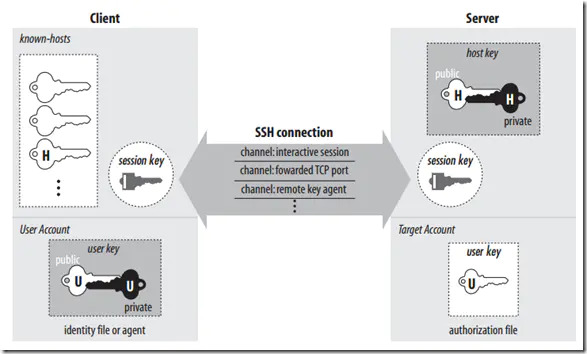

## SSH远程登录

### 概念

SSH 为 [Secure Shell](https://baike.baidu.com/item/Secure Shell) 的缩写，由 IETF 的网络小组（Network Working Group）所制定；SSH 为建立在应用层基础上的安全协议。SSH 是较可靠，专为[远程登录](https://baike.baidu.com/item/远程登录/1071998)会话和其他网络服务提供安全性的协议。利用 SSH 协议可以有效防止远程管理过程中的信息泄露问题。SSH最初是UNIX系统上的一个程序，后来又迅速扩展到其他操作平台。SSH在正确使用时可弥补网络中的漏洞。SSH客户端适用于多种平台。几乎所有UNIX平台—包括[HP-UX](https://baike.baidu.com/item/HP-UX)、[Linux](https://baike.baidu.com/item/Linux)、[AIX](https://baike.baidu.com/item/AIX)、[Solaris](https://baike.baidu.com/item/Solaris/3517)、[Digital](https://baike.baidu.com/item/Digital) [UNIX](https://baike.baidu.com/item/UNIX)、[Irix](https://baike.baidu.com/item/Irix)，以及其他平台，都可运行SSH。


### SSH基本框架




SSH协议框架中最主要的部分是三个协议：

* 传输层协议（The Transport Layer Protocol）提供服务器认证，数据机密性，信息完整性 等的支持；
* 用户认证协议（The User Authentication Protocol） 则为服务器提供客户端的身份鉴别；
* 连接协议（The Connection Protocol） 将加密的信息隧道复用成若干个逻辑通道，提供给更高层的应用协议使用； 各种高层应用协议可以相对地独立于SSH基本体系之外，并依靠这个基本框架，通过连接协议使用SSH的安全机制。

### SSH中的key

|   名称   |  生命周期    |  创建    |   类型   |   描述   |
| :--- | ---- | ---- | ---- | ---- |
| Host Key | 持久化 | 服务端 | Public Key | Host Key是服务器用来证明自己身份的一个永久性的非对称密钥 |
| User Key | 持久化 | 用户 | Public Key | User Key 是客户端用来证明用户身份的一个永久性的非对称密钥（一个用户可以有多个密钥/身份标识） |
| Server Key | 默认为1小时 | 服务端 | Public Key | Server Key 是SSH-1协议中使用的一个临时的非对称密钥，每隔一定的间隔（默认是一个小时）都会在服务器重新生成。用于对Session Key进行加密（仅SSH-1协议有，SSH-2对其进行了增强，这里Server Key作为一个概念便于在流程中进行描述） |
| Session Key | 客户端 | 会话（Session | Secret Key | Session Key是一个随机生成的对称密钥，用户SSH客户端和服务器之间的通信进行加密，会话结束时，被销毁 |

1. 


### 用法

SSH主要用于远程登录。假定你要以用户名user，登录远程主机host，只要一条简单命令就可以了。

```bash
$ ssh user@host
```

如果本地用户名与远程用户名一致，登录时可以省略用户名。

```bash
$ ssh host
```

SSH的默认端口是22，也就是说，你的登录请求会送进远程主机的22端口。使用p参数，可以修改这个端口。

```bash
$ ssh -p 2222 user@host
```


### 中间人攻击

SSH之所以能够保证安全，原因在于它采用了公钥加密。

整个过程是这样的：

1. 远程主机收到用户的登录请求，把自己的公钥发给用户。
2. 用户使用这个公钥，将登录密码加密后，发送回来。
3. 远程主机用自己的私钥，解密登录密码，如果密码正确，就同意用户登录。

这个过程本身是安全的，但是实施的时候存在一个风险：如果有人截获了登录请求，然后冒充远程主机，将伪造的公钥发给用户，那么用户很难辨别真伪。因为不像https协议，SSH协议的公钥是没有证书中心（CA）公证的，也就是说，都是自己签发的。

可以设想，如果攻击者插在用户与远程主机之间（比如在公共的wifi区域），用伪造的公钥，获取用户的登录密码。再用这个密码登录远程主机，那么SSH的安全机制就荡然无存了。这种风险就是著名的["中间人攻击"](http://en.wikipedia.org/wiki/Man-in-the-middle_attack)（Man-in-the-middle attack）。

SSH协议是如何应对的呢？

### 口令登录

如果你是第一次登录对方主机，系统会出现下面的提示：

```bash
$ ssh user@host
The authenticity of host 'host (12.18.429.21)' can't be established.
RSA key fingerprint is 98:2e:d7:e0:de:9f:ac:67:28:c2:42:2d:37:16:58:4d.
Are you sure you want to continue connecting (yes/no)?
```

这段话的意思是，无法确认host主机的真实性，只知道它的公钥指纹，问你还想继续连接吗？

所谓"公钥指纹"，是指公钥长度较长（这里采用RSA算法，长达1024位），很难比对，所以对其进行MD5计算，将它变成一个128位的指纹。上例中是`98:2e:d7:e0:de:9f:ac:67:28:c2:42:2d:37:16:58:4d`，再进行比较，就容易多了。

很自然的一个问题就是，用户怎么知道远程主机的公钥指纹应该是多少？回答是没有好办法，远程主机必须在自己的网站上贴出公钥指纹，以便用户自行核对。

假定经过风险衡量以后，用户决定接受这个远程主机的公钥

```bash
Are you sure you want to continue connecting (yes/no)? yes
```

系统会出现一句提示，表示host主机已经得到认可。

```bash
Warning: Permanently added 'host,12.18.429.21' (RSA) to the list of known hosts.
```

然后，会要求输入密码。

```bash
Password: (enter password)
```

如果密码正确，就可以登录了。

当远程主机的公钥被接受以后，它就会被保存在文件`$HOME/.ssh/known_hosts`之中。下次再连接这台主机，系统就会认出它的公钥已经保存在本地了，从而跳过警告部分，直接提示输入密码。

每个SSH用户都有自己的known_hosts文件，此外系统也有一个这样的文件，通常是/etc/ssh/ssh_known_hosts，保存一些对所有用户都可信赖的远程主机的公钥。

### 公钥登录

```bash
$ ssh-keygen
```

运行上面的命令以后，系统会出现一系列提示，可以一路回车。其中有一个问题是，要不要对私钥设置口令（passphrase），如果担心私钥的安全，这里可以设置一个。

运行结束以后，在$HOME/.ssh/目录下，会新生成两个文件：id_rsa.pub和id_rsa。前者是你的公钥，后者是你的私钥。

这时再输入下面的命令，将公钥传送到远程主机host上面：

```bash
$ ssh-copy-id user@host
```

如果还是不行，就打开远程主机的/etc/ssh/sshd_config这个文件，检查下面几行前面"#"注释是否取掉。

```bash
　RSAAuthentication yes
　PubkeyAuthentication yes
　AuthorizedKeysFile .ssh/authorized_keys
```

然后，重启远程主机的ssh服务。

###  authorized_keys文件

远程主机将用户的公钥，保存在登录后的用户主目录的$HOME/.ssh/authorized_keys文件中。公钥就是一段字符串，只要把它追加在authorized_keys文件的末尾就行了。

这里不使用上面的ssh-copy-id命令，改用下面的命令，解释公钥的保存过程：

```bash
$ ssh user@host 'mkdir -p .ssh && cat >> .ssh/authorized_keys' < ~/.ssh/id_rsa.pub
```

这条命令由多个语句组成，依次分解开来看：

1. "$ ssh user@host"，表示登录远程主机；
2. 单引号中的mkdir .ssh && cat >> .ssh/authorized_keys，表示登录后在远程shell上执行的命令：
3. "$ mkdir -p .ssh"的作用是，如果用户主目录中的.ssh目录不存在，就创建一个；
4. 'cat >> .ssh/authorized_keys' < ~/.ssh/id_rsa.pub的作用是，将本地的公钥文件~/.ssh/id_rsa.pub，重定向追加到远程文件authorized_keys的末尾。

