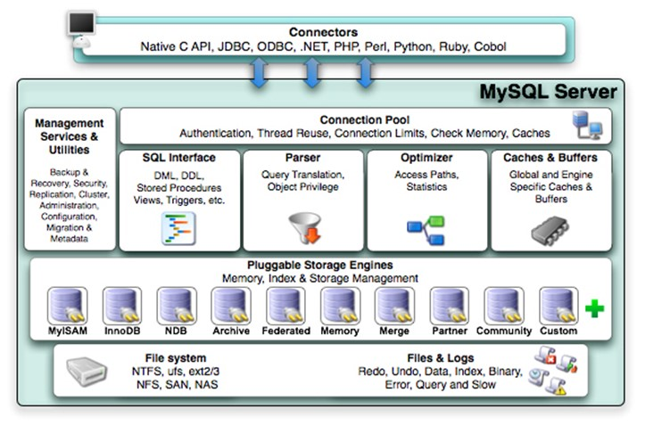
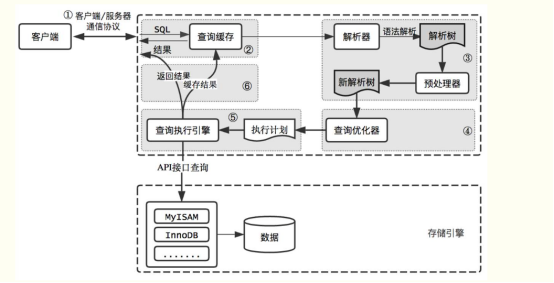
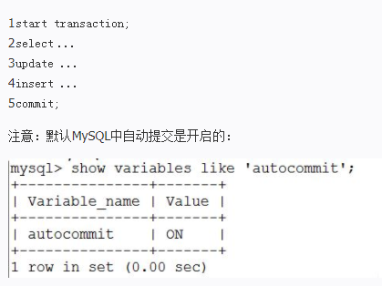
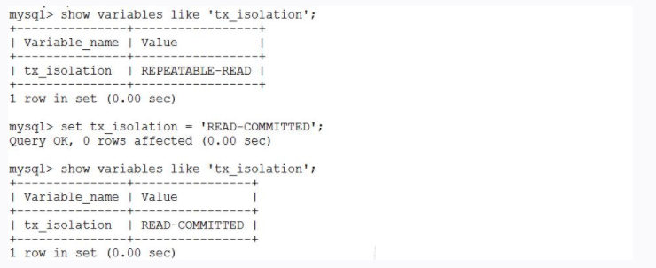
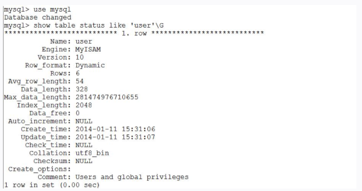

## MySQL

 ### 概念

MySQL是一个开放源代码的关系数据库管理系统。原开发者为瑞典的MySQL AB公司，最早是在2001年MySQL3.23进入到管理员的视野并在之后获得广泛的应用。 

2008年MySQL公司被Sun公司收购并发布了首个收购之后的版本MySQL5.1，该版本引入分区、基于行复制以及plugin API。

移除了原有的BerkeyDB引擎，同时，Oracle收购InnoDB Oy发布了InnoDB plugin，这后来发展成为著名的InnoDB引擎。

2010年Oracle收购Sun公司，这也使得MySQL归入Oracle门下，之后Oracle发布了收购以后的首个版本5.5，该版本主要改善集中在性能、扩展性、复制、分区以及对windows的支持。

目前版本已发展到5.7。和其它数据库相比，MySQL有点与众不同，它的架构可以在多种不同场景中应用并发挥良好作用。

主要体现在存储引擎的架构上，插件式的存储引擎架构将查询处理和其它的系统任务以及数据的存储提取相分离。这种架构可以根据业务的需求和实际需要选择合适的存储引擎。

MySQL架构可以在多种不同场景中应用并发挥良好作用。主要体现在存储引擎的架构上，插件式的存储引擎架构将查询处理和其它的系统任务以及数据的存储提取相分离。

### 逻辑架构

数据库管理系统结构：

MySQL是由SQL接口，解析器，优化器，缓存，存储引擎组成的。

如下图：



MySQL逻辑架构整体分为四层：

1. 最上层：

   最上层是一些客户端和连接服务，包含本地的sock通信和大多数基于客户端/服务端工具实现的类似于tcp/ip的通信，主要完成一些类似于连接处理、授权认证及相关的安全方案，

   在该层上引用了线程池的概念，为通过认证安全接入的客户端提供线程。同样在该层上可以实现基于ssl的安全链接。服务器也会为安全接入的每个客户端验证它所具有的操作权限。

2. 第二层：

   第二层架构主要完成大多数的核心服务功能。如sql接口，并完成缓存的查询。sql的分析和优化 以及部分内置函数的执行。

   所有跨存储引擎的功能也在这一层实现，如过程，函数等。在该层，服务器会解析查询并创建相应的内部解析树，并对其完成相应的优化如确定查询表的顺序，是否利用索引等。

   最后生成相应的执行操作。如select语句，服务器还会查询内部的缓存。如果缓存空间足够大，这样就解决大量读操作的环境中能够很好的提升系统的性能。

3. 存储引擎：

   存储引擎真正的负责MySQL中数据的存储和提取，服务器通过API与存储引擎进行通信，不同的存储引擎具有的功能不同，这样可以根据自己的实际需进行选取。

4. 数据存储层：

   主要是将数据存储在运行于裸设备的文件系统之上，并完成于存储引擎的交互。

### 组件说明

**connectors：**

与其他编程语言中的sql 语句进行交互，如php、java等。

**Management Serveices & Utilities：**

系统管理和控制工具。

**Connection Pool (连接池)：**

管理缓冲用户连接，线程处理等需要缓存的需求。

**SQL Interface (SQL接口)：**

接受用户的SQL命令，并且返回用户需要查询的结果。比如select from就是调用SQL Interface。

**Parser （解析器）：**

SQL命令传递到解析器的时候会被解析器验证和解析。

主要功能：

- 将SQL语句分解成数据结构，并将这个结构传递到后续步骤，后面SQL语句的传递和处理就是基于这个结构的；
- 如果在分解构成中遇到错误，那么就说明这个sql语句是不合理的，语句将不会继续执行下去。

**Optimizer (查询优化器)：**

SQL语句在查询之前会使用查询优化器对查询进行优化(产生多种执行计划，最终数据库会选择最优化的方案去执行，尽快返会结果) 他使用的是“选取-投影-联接”策略进行查询。

用一个例子就可以理解： select uid,name from user where gender = 1；

这个select 查询先根据where 语句进行选取，而不是先将表全部查询出来以后再进行gender过滤，

这个select查询先根据uid和name进行属性投影，而不是将属性全部取出以后再进行过滤，将这两个查询条件联接起来生成最终查询结果。

**Cache和Buffer (查询缓存)：**

如果查询缓存有命中的查询结果，查询语句就可以直接去查询缓存中取数据。这个缓存机制是由一系列小缓存组成的。比如表缓存，记录缓存，key缓存，权限缓存等。

**Engine (存储引擎)：**

存储引擎是MySql中具体的与文件打交道的子系统。也是Mysql最具有特色的一个地方。

Mysql的存储引擎是插件式的。它根据MySql AB公司提供的文件访问层的一个抽象接口来定制一种文件访问机制（这种访问机制就叫存储引擎）。

### 执行过程

数据库通常不会被直接使用，而是由其他编程语言通过SQL语句调用mysql，由mysql处理并返回执行结果。那么Mysql接受到SQL语句后，又是如何处理？

首先程序的请求会通过mysql的connectors与其进行交互，请求到处后，会暂时存放在连接池（connection pool)中并由处理器（Management Serveices & Utilities）管理。

当该请求从等待队列进入到处理队列，管理器会将该请求丢给SQL接口（SQL Interface）。

SQL接口接收到请求后，它会将请求进行hash处理并与缓存中的结果进行对比，如果完全匹配则通过缓存直接返回处理结果；否则，需要完整的走一趟流程：

（1）由SQL接口丢给后面的解释器（Parser），解释器会判断SQL语句正确与否，若正确则将其转化为数据结构。

（2）解释器处理完，便来到后面的优化器（Optimizer），它会产生多种执行计划,最终数据库会选择最优化的方案去执行,尽快返会结果。

（3）确定最优执行计划后，SQL语句此时便可以交由存储引擎（Engine）处理，存储引擎将会到后端的存储设备中取得相应的数据，并原路返回给程序。

Sql语句执行过程图解：



注意点：

**（1）如何缓存查询数据**

存储引擎处理完数据，并将其返回给程序的同时，它还会将一份数据保留在缓存中，以便更快速的处理下一次相同的请求。

具体情况是，mysql会将查询的语句、执行结果等进行hash，并保留在cache中，等待下次查询。

**（2）buffer与cache的区别**

从mysql原理图可以看到，缓存那里实际上有buffer和cache两个，那它们之间的区别：简单的说就是，buffer是写缓存，cache是读缓存。

**（3）如何判断缓存中是否已缓存需要的数据**

这里可能有一个误区，觉得处理SQL语句的时候，为了判断是否已缓存查询结果，会将整个流程走一遍，取得执行结果后再与需要的进行对比，看看是否命中，

并以此说，既然不管缓存中有没有缓存到查询内容，都要整个流程走一遍，那缓存的优势在哪？

其实并不是这样，在第一次查询后，mysql便将查询语句以及查询结果进行hash处理并保留在缓存中，SQL查询到达之后，对其进行同样的hash处理后，

将两个hash值进行对照，如果一样，则命中，从缓存中返回查询结果；否则，需要整个流程走一遍。


首先要清楚redo log和binlog两个日志模块:

1、redo log（InnoDB特有的日志模块） 重做日志文件，用于记录事务操作的变化，记录修改后的值，不管事务是否提交。保证数据的完整性。

其中redo log是固定大小的，是从头开始写，写到末尾在从头开始。同时会有两个指针，一个记录写入的位置，一个标记，当前擦除的位置，不断的循环。

整个过程称为crash-safe。即时数据库异常，也会有记录

2、binlog 归档日志文件，用于记录对mysql数据库执行更改的所有操作。binlog是追加写，不会覆盖之前的。

接下来介绍一下mysql更新一条语句的流程。

```sql
update tb_area SET area_name = "beijing" WHERE area_id = 1
```

（1）首先执行器通过id查到这条记录（搜索树或者查找数据页） ，并加载到内存中。

（2）然后对这条记录的area_name调用引擎写入接口，进行修改。

（3）修改内存中的值，同时更新redolog告知执行器完成写入（状态置为prepare），可以提交事务，执行器将这条操作记录记录在binlog，写入磁盘

（4）完成上述一系列的操作，执行器调用事务提交接口（redolog状态置为commit），完成更新操作。

**注意：**

Mysql的redolog模块写入拆成2步走，prepare和commit，称为两阶段提交。

整个过程为1、redolog的prepare状态 2、binlog的写入 3、redolog的commit状态，保证Mysql的可靠性。

如果binlog没有写入并没有提交事务回滚，如果binlog写入事务没提交，数据库回复后自动完成commit。

### 并发控制和锁

Mysql 中的并发控制在存储引擎层实现。

解决并发问题最有效的方案是锁的机制。

锁在功能上分为：

（1）共享锁（shared lock）既读锁，可以允许其他select操作；

（2）排它锁（exclusive lock）既写锁，不允许任何其他操作；

锁在粒度上分为：

（1）表级锁（table lock），锁定表；

（2）行级锁（row lock），锁定行；

Mysql中大多数事务型存储引擎都不是简单的行级锁，给予性能的考虑，一般都同事实现了 **多版本并发控制（MVCC）**。

当数据库中有多个操作需要修改同一数据时，不可避免的会产生数据的脏读。这时就需要数据库具有良好的并发控制能力，这一切在MySQL中都是由服务器和存储引擎来实现的。

解决并发问题最有效的方案是引入了锁的机制，锁在功能上分为共享锁(shared lock)和排它锁(exclusive lock)即通常说的读锁和写锁。

当一个select语句在执行时可以施加读锁，这样就可以允许其它的select操作进行，因为在这个过程中数据信息是不会被改变的这样就能够提高数据库的运行效率。

当需要对数据更新时，就需要施加写锁了，不在允许其它的操作进行，以免产生数据的脏读和幻读。

锁同样有粒度大小，有表级锁(table lock)和行级锁(row lock)，分别在数据操作的过程中完成行的锁定和表的锁定。这些根据不同的存储引擎所具有的特性也是不一样的。

MySQL大多数事务型的存储引擎都不只是简单的行级锁，基于性能的考虑，他们一般在行级锁基础上实现了多版本并发控制(MVCC)。

这一方案也被Oracle等主流的关系数据库采用。它是通过保存数据中某个时间点的快照来实现的，这样就保证了每个事务看到的数据都是一致的。详细的实现原理可以参考《高性能MySQL》第三版。

### 事务

简单的说事务就是一组原子性的SQL语句。可以将这组语句理解成一个工作单元，要么全部执行要么都不执行。默认MySQL中自动提交时开启的（start transaction）。

操作事务：



**事务具有ACID的特性：**

**（1）原子性：**

事务中的所有操作要么全部提交成功，要么全部失败回滚。

比如从取款机取钱,这个事务可以分成两个步骤：1划卡，2出钱，不可能划了卡，而钱却没出来，这两步必须同时完成，要么就不完成。

**（2）一致性：**

数据库总是从给一个一致性的状态转换到另一个一致性的状态

例如：完整性约束了a+b=10，一个事务改变了a，那么b也应该随之改变，不管数据怎么改变。一定是符合约束。

**（3）隔离性：**

一个事务所做的修改在提交之前对其它事务是不可见的，两个以上的事务不会出现交错执行的状态.因为这样可能会导致数据不一致。

**（4）持久性：**

一旦事务提交，其所做的修改便会永久保存在数据库中。

**事务的隔离级别：**

（1）READ UNCOMMITTED(读未提交)：事务中的修改即使未提交也是对其它事务可见；

（2）READ COMMITTED(读提交)：事务提交后所做的修改才会被另一个事务看见，可能产生一个事务中两次查询的结果不同。

（3）REPEATABLE READ(可重读)：只有当前事务提交才能看见另一个事务的修改结果。解决了一个事务中两次查询的结果不同的问题。

（4）SERIALIZABLE(串行化)：只有一个事务提交之后才会执行另一个事务。

查询并修改隔离级别：



死锁：

两个或多个事务在同一资源上相互占用并请求锁定对方占用的资源，从而导致恶性循环的现象。

对于死锁的处理：MySQL的部分存储引擎能够检测到死锁的循环依赖并产生相应的错误。InnoDB引擎解决的死锁的方案是将持有最少写锁的事务进行回滚。

为了提供回滚或者撤销未提交的变化的能力，许多数据源采用日志机制。例如：sql server使用一个预写事务日志，在将数据应用于（或提交到）实际数据页面前，先写在事务日志上。

但是，其他一些数据源不是关系型数据库管理系统，他们管理未提交事务的方式完全不同。只要事务回滚时，数据源可以撤销所有未提交的改变，那么这种技术可用于事务管理。

### 存储引擎及应用方案

MySQL采用插件式的存储引擎的架构，可以根据不同的需求为不同的表设置不同的存储引擎。

如：



相关字段介绍：

Name：显示的是表名。

Engine：显示存储引擎，该表存储引擎为MyISAM。

Row_format：显示行格式，对于MyISAM有Dynamic、Fixed和Compressed三种。非别表示表中有可变的数据类型，表中数据类型为固定的，以及表是压缩表的环境。

Rows：显示表中行数。

Avg_row_length：平均行长度（字节）。

Data_length：数据长度（字节）。

Max_data_length：最大存储数据长度（字节）。

Data_free：已分配但未使用的空间，包括删除数据空余出来的空间。

Auto_increment：下一个插入行自动增长字段的值。

Create_time：表的创建时间。

Update_time：表数据的最后修改时间。

Collation：表的默认字符集及排序规则。

Checksum：如果启用，表示整个表的实时校验和。

Create_options：创建表示的一些其它选项。

Comment：额外的一些注释信息，根据存储引擎的不同表示的内容也不胫相同。


常用MySQL存储引擎介绍：

**（1）InnoDB引擎：**

将数据存储在表空间中，表空间由一系列的数据文件组成，由InnoDb管理，支持每个表的数据和索引存放在单独文件中(innodb_file_per_table)；

支持事务，采用MVCC来控制并发，并实现标准的4个事务隔离级别，支持外键。索引基于聚簇索引建立，对主键查询有较高性能。

数据文件的平台无关性，支持数据在不同的架构平台移植；能够通过一些工具支持真正的热备，如XtraBackup等；

内部进行自身优化如采取可预测性预读，能够自动在内存中创建bash索引等。

**（2）MyISAM引擎：**

MySQL5.1默认，不支持事务和行级锁，提供大量的特性如全文索引、空间函数、压缩、延迟更新等。

数据库故障后，安全恢复性，对于只读数据可以忍受故障恢复，MyISAM依然非常适用。

日志服务器的场景也比较适用，只需插入和数据读取操作，不支持单表一个文件，会将所有的数据和索引内容分别存放在两个文件中。

MyISAM对整张表加锁而不是对行，所以不适用写操作比较多的场景，支持索引缓存不支持数据缓存。

**（3）Archive 引擎：**

只支持 insert 和 select 操作；

缓存所有的写数据并进行压缩存储，支持行级锁但不支持事务；

适合高速插入和数据压缩，减少 IO 操作，适用于日志记录和归档服务器。

**（4）Blackhole 引擎：**

没有实现任何存储机制，会将插入的数据进行丢弃，但会存储二进制日志；

会在一些特殊需要的复制架构的环境中使用。

**（5）CSV 引擎：**

可以打开 CSV 文件存储的数据，可以将存储的数据导出，并利用 excel 打开；

可以作为一种数据交换的机制，同样经常使用。

**（6）Memory 引擎：**

将数据在内存中缓存，不消耗 IO ；

存储数据速度较快但不会被保留，一般作为临时表的存储被使用。

**（7）Federated 引擎：**

能够访问远程服务器上的数据的存储引擎。

能够建立一个连接连到远程服务器。

**（8）Mrg_MyISAM 引擎：**

将多个 MYISAM 表合并为一个。

本身并不存储数据，数据存在 MyISAM 表中间。

**（9）NDB 集群引擎：**

MySQL Cluster 专用。


存储引擎选取参考因素：

（1）是否有事务需求

如果需要事务支持最好选择 InnoDB 或者 XtraDB ，如果主要是 select 和 insert 操作 MyISAM 比较合适，一般使用日志型的应用。

（2）备份操作需求

如果能够关闭服务器进行备份，那么该因素可以忽略，如果需要在线进行热备份，则 InnoDB 引擎是一个不错的选择。

（3）故障恢复需求

在对恢复要求比较好的场景中推荐使用 InnoDB ，因为 MyISAM 数据损坏概率比较大而且恢复速度比较慢。

（4）性能上的需求

有些业务需求只有某些特定的存储引擎才能够满足，如地理空间索引也只有 MyISAM 引擎支持。

所以在应用架构需求环境中也需要管理员折衷考虑，当然从各方面比较而言， InnoDB 引擎还是默认应该被推荐使用的。