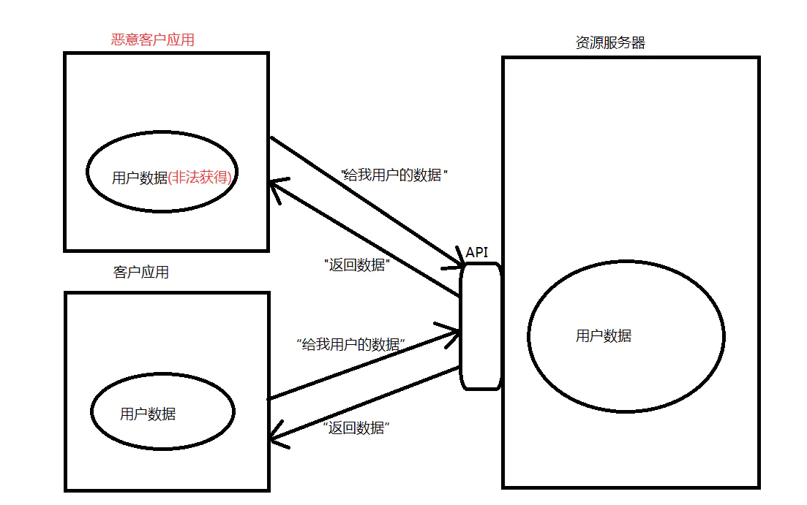
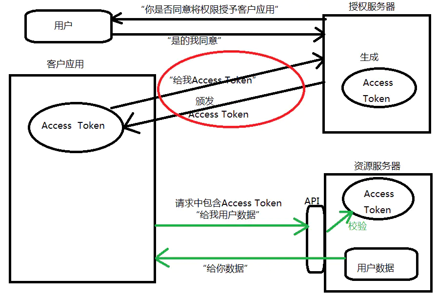
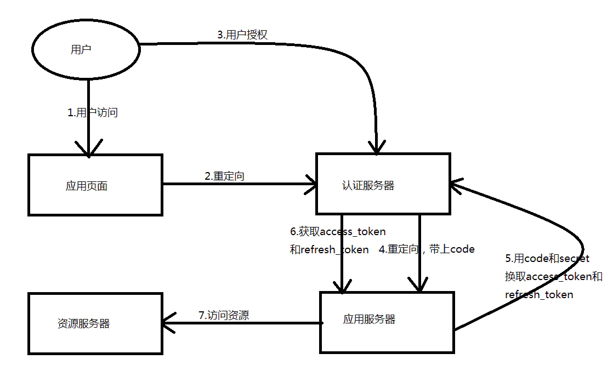
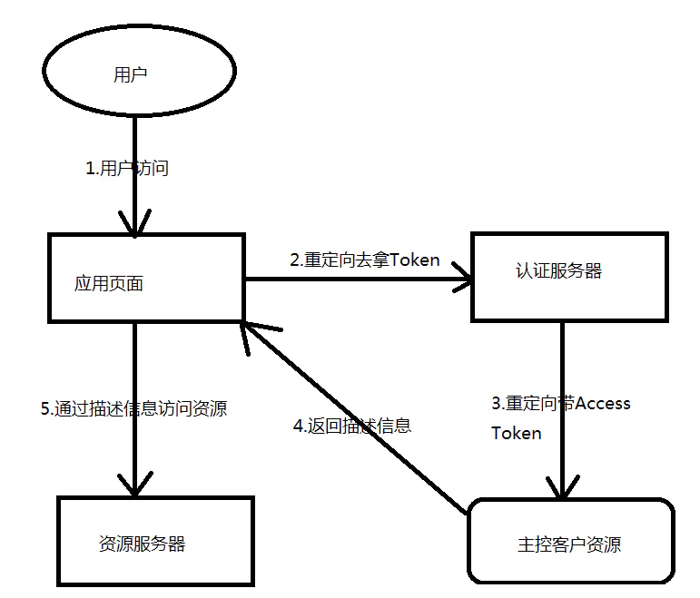
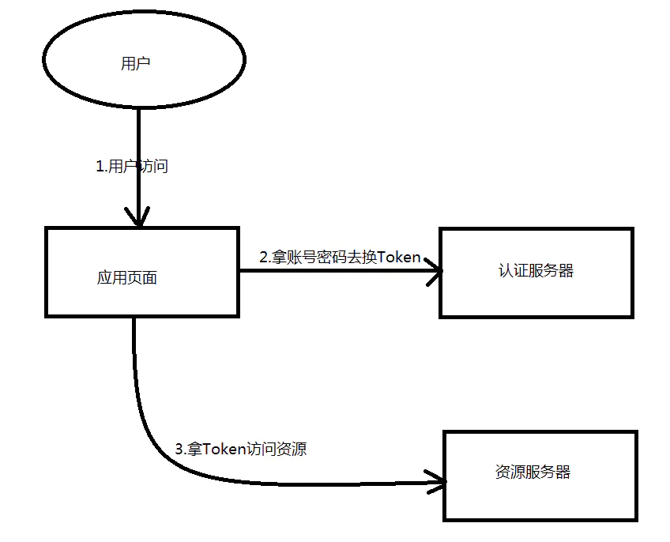
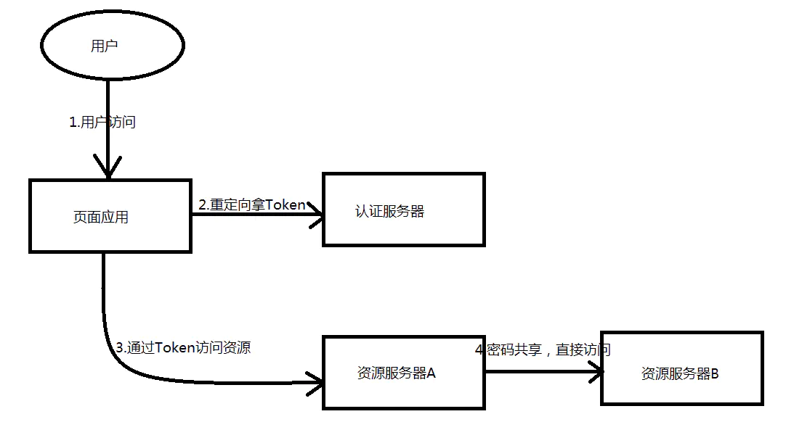

## OAuth2.0

OAuth2.0是一个授权框架，他规定了客户从授权服务器获取Access Token的规则。

### OAuth2.0需要解决的问题

要理解OAuth2.0，先要知道为什么会有这个东西产生，或者说他能帮我们解决什么问题，其实简单说他就是帮我们解决了访问安全问题。先看如下的一张图：

图片显示了我们没有引入任何安全机制情况下的资源访问过程，可以看到正常的用户和恶意的用户都可以通过向资源服务器的接口发送请求获得用户数据。显然恶意用户不该获取数据，他是非法获得，这个情况不应该被允许，需要一种机制保护用户数据。

### OAuth2.0的授权机制

上面提到了需要提供一种机制来保护数据，OAuth2.0提供的就是一种授权机制，就是说用户要访问资源必须先通过授权服务器授权拿到Access Token(访问授权)，他拿着这个Access Token才能去资源服务器去要他想要的数据，示意图如下：

这里看到我们引入了一个授权服务器，这个授权服务器就是专门负责颁发AccessToken的，客户应用需要从授权服务器中获取AccessToken，获得后再向资源服务器去获取数据，请求中包含了Token一起发到资源服务器，资源服务器首先要验证这个Token是否合法，如果合法再返回数据给客户应用。
上图中红色圈圈圈起来的就是OAuth2.0框架协议工作的地方，他规定了客户应用如何获取Access Token，以及如何使用Token的整个过程。

### 术语

案例： 使用“微信登录”登录到哔哩哔哩

| 专业称呼   | 通俗叫法                                                     |
| ---------- | ------------------------------------------------------------ |
| 资源所有者 | 用户                                                         |
| 资源服务器 | 保存用户信息的服务器并且能够验证令牌是否合法（比如说，微信服务器，保存你的微信头像等） |
| 客户端     | 第三方应用（哔哩哔哩客户端）                                 |
| 授权服务器 | 发送令牌给第三方的服务器（可以和资源服务器同一个）           |

### OAuth2.0的四种授权模式的实现方式

OAuth2.0中规定了多种授权模式，各种模式实现的复杂程度和安全系数不一样，我们先分别看一下四种授权模式：

**1）授权码(Authrization Code)模式：**

基本流程是先通过前端渠道客户获取授权码，然后通过后端渠道，客户使用Authrization Code去交换AccessToken和可选的RefreshToken，这种模式是最安全的模式，因为令牌不会通过user-agent去传递，完整的过程如下图：

授权码模式的优点是比较安全，有token过期时间，而且上面的第四和第五部都是在服务器之间的访问，很难被截获，用户信息也存在服务端，这样就保证了他的安全性。他的缺点是需要进行多次请求才能访问到资源。
授权码模式假定资源拥有者和客户不在一台设备上，他拥有高安全性的保障，目前市面上主流的第三方认证都是采用这种模式。

**2)隐式/简化(Implicit)模式**

基本流程是Access Token直接通过前端渠道从授权服务器返回，完整的过程如下图：

简化模式的优点是简单，缺点是容易受到安全攻击，通常是没有refresh_token没法更新token，token有暴露的风险。
 简化模式假定资源拥有者和客户在相同的设备上，适合公开的浏览器单页应用，比较适合用作问卷调查，评论这一类系统中采用这种模式。

**3)密码(Resource Owner Password)模式**

基本流程是使用用户名/密码作为授权方式从授权服务器上获取Access Token，而且一般不支持refresh token，完整的过程如下图：

密码模式假定资源拥有者和客户在相同的设备上，适合一般的需要用户名/密码登录的一些桌面App应用。

**4)客户端(Client)模式**

基本流程是通过后端渠道去获取一个Access Token，因为客户凭证可以使用对称或者非对称加密，该方式支持共享密码和证书，完整的过程如下图：

客户端模式适合用作服务器间通信场景。

