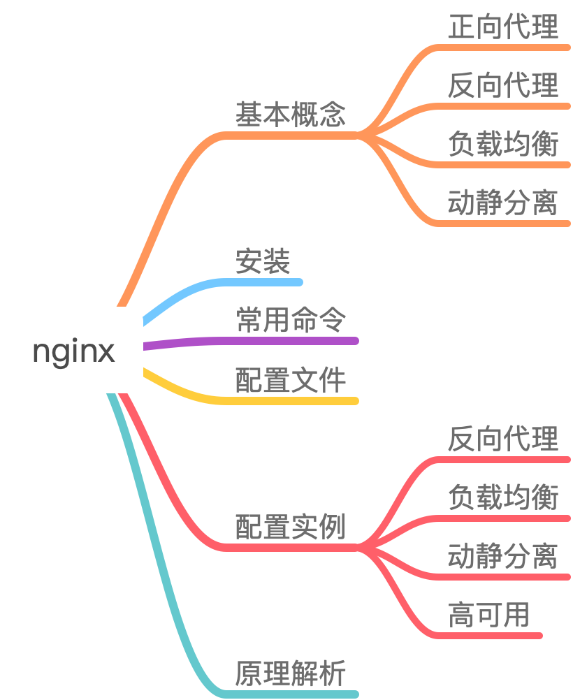
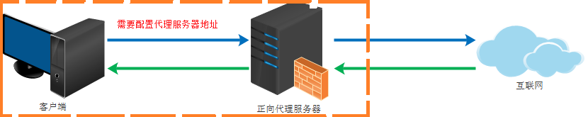
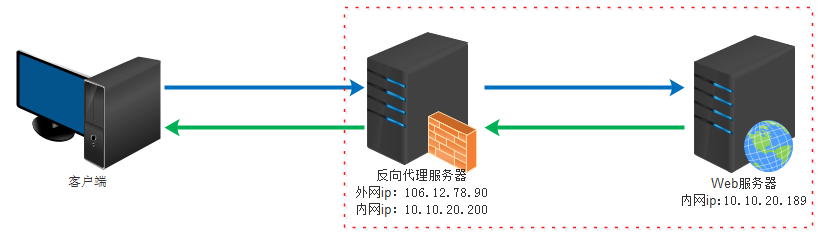
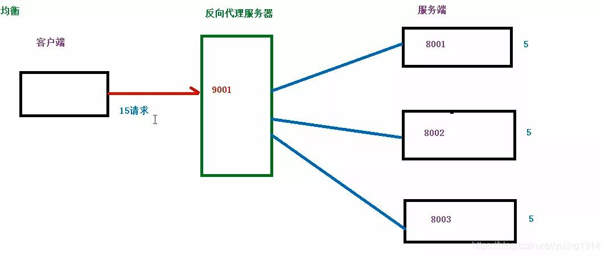
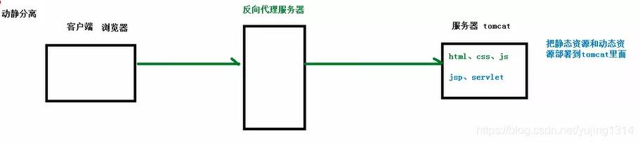
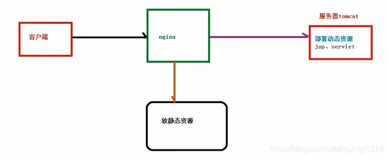

### 知识网结构图

Nginx是一个高性能的HTTP和反向代理服务器，特点是占用内存少，并发能力强，事实上nginx的并发能力确实在同类型的网页服务器中表现较好。

nginx专为性能优化而开发，性能是其最重要的要求，十分注重效率，有报告nginx能支持高达50000个并发连接数。

#### 正向代理

正向代理类似一个跳板机，代理访问外部资源。

比如我们国内访问谷歌，直接访问访问不到，我们可以通过一个正向代理服务器，请求发到代理服，代理服务器能够访问谷歌，这样由代理去谷歌取到返回数据，再返回给我们，这样我们就能访问谷歌了。

**正向代理的用途：**

- 访问原来无法访问的资源，如google
-  可以做缓存，加速访问资源
- 对客户端访问授权，上网进行认证
- 代理可以记录用户访问记录（上网行为管理），对外隐藏用户信息

#### 反向代理

反向代理（Reverse Proxy）实际运行方式是指以代理服务器来接受internet上的连接请求，然后将请求转发给内部网络上的服务器，并将从服务器上得到的结果返回给internet上请求连接的客户端，此时代理服务器对外就表现为一个服务器

**反向代理的作用：**

- 保证内网的安全，阻止web攻击，大型网站，通常将反向代理作为公网访问地址，Web服务器是内网
- 负载均衡，通过反向代理服务器来优化网站的负载

#### 负载均衡

客户端发送多个请求到服务器，服务器处理请求，有一些可能要与数据库进行交换，服务器处理完毕之后，再将结果返回给客户端。

普通请求和响应过程：

但是随着信息数量增长，访问量和数据量飞速增长，普通架构无法满足现在的需求。

我们首先想到的是升级服务器配置，可以由于摩尔定律的日益失效，单纯从硬件提升性能已经逐渐不可取了，怎么解决这种需求呢？

我们可以增加服务器的数量，构建集群，将请求分发到各个服务器上，将原来请求集中到单个服务器的情况改为请求分发到多个服务器，也就是我们说的负载均衡

**图解负载均衡**

假设有15个请求发送到代理服务器，那么由代理服务器根据服务器数量，平均分配，每个服务器处理5个请求，这个过程就叫做负载均衡

#### 动静分离

为了加快网站的解析速度，可以把动态页面和静态页面交给不同的服务器来解析，加快解析的速度，降低由单个服务器的压力

**动静分离之前的状态：**

**动静分离之后:**

