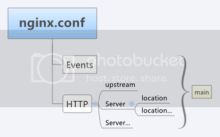

## nginx配置文件

### 文件结构

Nginx的配置文件nginx.conf位于其安装目录的conf目录下。
nginx.conf由多个块组成，最外面的块是main，main包含Events和HTTP，HTTP包含upstream和多个Server，Server又包含多个location：



main（全局设置）、server（主机设置）、upstream（负载均衡服务器设置）和 location（URL匹配特定位置的设置）。

- main块设置的指令将影响其他所有设置；
- server块的指令主要用于指定主机和端口；
- upstream指令主要用于负载均衡，设置一系列的后端服务器；
- location块用于匹配网页位置。

这四者之间的关系式：server继承main，location继承server，upstream既不会继承其他设置也不会被继承。
在这四个部分当中，每个部分都包含若干指令，这些指令主要包含Nginx的主模块指令、事件模块指令、HTTP核心模块指令，同时每个部分还可以使用其他HTTP模块指令，例如Http SSL模块、HttpGzip Static模块和Http Addition模块等。

### location

**语法规则:**

location [=|~|~*|^~] /uri/ { … }
|   模式   |   含义   |
| ---- | :--- |
| location = /uri | = 表示精确匹配，只有完全匹配上才能生效 |
| location ^~ /uri | ^~ 开头对URL路径进行前缀匹配，并且在正则之前。 |
| location ~ patter | 开头表示区分大小写的正则匹配 |
| location ~* pattern | 开头表示不区分大小写的正则匹配 |
| location /uri | 不带任何修饰符，也表示前缀匹配，但是在正则匹配之后 |
| location / | 通用匹配，任何未匹配到其它location的请求都会匹配到，相当于switch中的default |

前缀匹配时，Nginx 不对 url 做编码，因此请求为 /static/20%/aa ，可以被规则 ^~ /static/ /aa 匹配到（注意是空格）

多个 location 配置的情况下匹配顺序为（参考资料而来，还未实际验证，试试就知道了，不必拘泥，仅供参考）:

1. 首先精确匹配 =
2. 其次前缀匹配 ^~
3. 其次是按文件中顺序的正则匹配
4. 然后匹配不带任何修饰的前缀匹配。
5. 最后是交给 / 通用匹配
6. 当有匹配成功时候，停止匹配，按当前匹配规则处理请求

**注意：** 前缀匹配，如果有包含关系时，按最大匹配原则进行匹配。比如在前缀匹配： `location /dir01 `与 `location /dir01/dir02 `，如有请求` http://localhost/dir01/dir02/file `将最终匹配到 `location /dir01/dir02`

例子，有如下匹配规则：

```bash
location = / {
  echo "规则A";
}
location = /login {
  echo "规则B";
}
location^~ /static/ {
  echo "规则C";
}
location^~ /static/files {
  echo "规则X";
}
location ~ \.(gif|jpg|png|js|css)$ {
  echo "规则D";
}
location ~* \.png$ {
  echo "规则E";
}
location /img {
  echo "规则Y";
}
location / {
  echo "规则F";
}
```

那么产生的效果如下：

1. 访问根目录` /` ，比如 `http://localhost/ `将匹配 规则A
2. 访问 `http://localhost/login `将匹配 规则B ，` http://localhost/register `则匹配 规则F
3. 访问` http://localhost/static/a.html `将匹配 规则C
4. 访问 `http://localhost/static/files/a.exe `将匹配 规则X ，虽然 规则C 也能匹配到，但因为最大匹配原则，最终选中了 规则X 。你可以测试下，去掉规则 X ，则当前 URL 会匹配上 规则C 。
5. 访问 `http://localhost/a.gif `, `http://localhost/b.jpg` 将匹配 规则D 和 规则 E ，但是 规则 D 顺序优先， 规则 E 不起作用，而 `http://localhost/static/c.png `则优先匹配到 规则 C
6. 访问` http://localhost/a.PNG `则匹配 规则 E ，而不会匹配 规则 D ，因为 规则 E 不区分大小写。
7. 访问` http://localhost/img/a.gif `会匹配上 规则D ,虽然 规则Y 也可以匹配上，但是因为正则匹配优先，而忽略了 规则Y 。
8. 访问 `http://localhost/img/a.tiff `会匹配上 规则Y 。
9. 访问` http://localhost/category/id/1111 `则最终匹配到规则 F ，因为以上规则都不匹配，这个时候应该是 Nginx 转发请求给后端应用服务器，比如 FastCGI（php），tomcat（jsp），Nginx 作为反向代理服务器存在。

所以实际使用中，笔者觉得至少有三个匹配规则定义，如下：

```bash
# 直接匹配网站根，通过域名访问网站首页比较频繁，使用这个会加速处理，官网如是说。
# 这里是直接转发给后端应用服务器了，也可以是一个静态首页
# 第一个必选规则
location = / {
  proxy_pass http://tomcat:8080/index
}
 
# 第二个必选规则是处理静态文件请求，这是 nginx 作为 http 服务器的强项
# 有两种配置模式，目录匹配或后缀匹配，任选其一或搭配使用
location ^~ /static/ {
  root /webroot/static/;
}
location ~* \.(gif|jpg|jpeg|png|css|js|ico)$ {
  root /webroot/res/;
}
 
# 第三个规则就是通用规则，用来转发动态请求到后端应用服务器
# 非静态文件请求就默认是动态请求，自己根据实际把握
# 毕竟目前的一些框架的流行，带.php、.jsp后缀的情况很少了
location / {
  proxy_pass http://tomcat:8080/
}

```

### rewrite

**rewrite 语法**

- last – 基本上都用这个 Flag
- break – 中止 Rewirte，不再继续匹配
- redirect – 返回临时重定向的 HTTP 状态 302
- permanent – 返回永久重定向的 HTTP 状态 301

下面是可以用来判断的表达式：

- -f 和 !-f 用来判断是否存在文件
- -d 和 !-d 用来判断是否存在目录
- -e 和 !-e 用来判断是否存在文件或目录
- -x 和 !-x 用来判断文件是否可执行

下面是可以用作判断的全局变量:

```bash
http://localhost:88/test1/test2/test.php?k=v
$host：localhost
$server_port：88
$request_uri：/test1/test2/test.php?k=v
$document_uri：/test1/test2/test.php
$document_root：D:\nginx/html
$request_filename：D:\nginx/html/test1/test2/test.php

```

**redirect语法用例**

```bash
server {
  listen 80;
  server_name start.igrow.cn;
  index index.html index.php;
  root html;
  if ($http_host !~ "^star\.igrow\.cn$") {
    rewrite^(.*) http://star.igrow.cn$1 redirect;
  }
}
```

**防盗链**

```bash
location ~* \.(gif|jpg|swf)$ {
  valid_referers none blocked start.igrow.cn sta.igrow.cn;
  if ($invalid_referer) {
    rewrite^/ http://$host/logo.png;
  }
}
```

**根据文件类型设置过期时间**

```bash
location ~* \.(js|css|jpg|jpeg|gif|png|swf)$ {
  if (-f $request_filename) {
    expires 1h;
    break;
  }
}
```

### 配置文件详解

```bash
######Nginx配置文件nginx.conf中文详解#####

#定义Nginx运行的用户和用户组
user www www;

#nginx进程数，建议设置为等于CPU总核心数。
worker_processes 8;
 
#全局错误日志定义类型，[ debug | info | notice | warn | error | crit ]
error_log /usr/local/nginx/logs/error.log info;

#进程pid文件
pid /usr/local/nginx/logs/nginx.pid;

#指定进程可以打开的最大描述符：数目
#工作模式与连接数上限
#这个指令是指当一个nginx进程打开的最多文件描述符数目，理论值应该是最多打开文件数（ulimit -n）与nginx进程数相除，但是nginx分配请求并不是那么均匀，所以最好与ulimit -n 的值保持一致。
#现在在linux 2.6内核下开启文件打开数为65535，worker_rlimit_nofile就相应应该填写65535。
#这是因为nginx调度时分配请求到进程并不是那么的均衡，所以假如填写10240，总并发量达到3-4万时就有进程可能超过10240了，这时会返回502错误。
worker_rlimit_nofile 65535;


events
{
    #参考事件模型，use [ kqueue | rtsig | epoll | /dev/poll | select | poll ]; epoll模型
    #是Linux 2.6以上版本内核中的高性能网络I/O模型，linux建议epoll，如果跑在FreeBSD上面，就用kqueue模型。
    #补充说明：
    #与apache相类，nginx针对不同的操作系统，有不同的事件模型
    #A）标准事件模型
    #Select、poll属于标准事件模型，如果当前系统不存在更有效的方法，nginx会选择select或poll
    #B）高效事件模型
    #Kqueue：使用于FreeBSD 4.1+, OpenBSD 2.9+, NetBSD 2.0 和 MacOS X.使用双处理器的MacOS X系统使用kqueue可能会造成内核崩溃。
    #Epoll：使用于Linux内核2.6版本及以后的系统。
    #/dev/poll：使用于Solaris 7 11/99+，HP/UX 11.22+ (eventport)，IRIX 6.5.15+ 和 Tru64 UNIX 5.1A+。
    #Eventport：使用于Solaris 10。 为了防止出现内核崩溃的问题， 有必要安装安全补丁。
    use epoll;

    #单个进程最大连接数（最大连接数=连接数*进程数）
    #根据硬件调整，和前面工作进程配合起来用，尽量大，但是别把cpu跑到100%就行。每个进程允许的最多连接数，理论上每台nginx服务器的最大连接数为。
    worker_connections 65535;

    #keepalive超时时间。
    keepalive_timeout 60;

    #客户端请求头部的缓冲区大小。这个可以根据你的系统分页大小来设置，一般一个请求头的大小不会超过1k，不过由于一般系统分页都要大于1k，所以这里设置为分页大小。
    #分页大小可以用命令getconf PAGESIZE 取得。
    #[root@web001 ~]# getconf PAGESIZE
    #4096
    #但也有client_header_buffer_size超过4k的情况，但是client_header_buffer_size该值必须设置为“系统分页大小”的整倍数。
    client_header_buffer_size 4k;

    #这个将为打开文件指定缓存，默认是没有启用的，max指定缓存数量，建议和打开文件数一致，inactive是指经过多长时间文件没被请求后删除缓存。
    open_file_cache max=65535 inactive=60s;

    #这个是指多长时间检查一次缓存的有效信息。
    #语法:open_file_cache_valid time 默认值:open_file_cache_valid 60 使用字段:http, server, location 这个指令指定了何时需要检查open_file_cache中缓存项目的有效信息.
    open_file_cache_valid 80s;

    #open_file_cache指令中的inactive参数时间内文件的最少使用次数，如果超过这个数字，文件描述符一直是在缓存中打开的，如上例，如果有一个文件在inactive时间内一次没被使用，它将被移除。
    #语法:open_file_cache_min_uses number 默认值:open_file_cache_min_uses 1 使用字段:http, server, location  这个指令指定了在open_file_cache指令无效的参数中一定的时间范围内可以使用的最小文件数,如果使用更大的值,文件描述符在cache中总是打开状态.
    open_file_cache_min_uses 1;
    
    #语法:open_file_cache_errors on | off 默认值:open_file_cache_errors off 使用字段:http, server, location 这个指令指定是否在搜索一个文件是记录cache错误.
    open_file_cache_errors on;
}
 
 
 
#设定http服务器，利用它的反向代理功能提供负载均衡支持
http
{
    #文件扩展名与文件类型映射表
    include mime.types;

    #默认文件类型
    default_type application/octet-stream;

    #默认编码
    #charset utf-8;

    #服务器名字的hash表大小
    #保存服务器名字的hash表是由指令server_names_hash_max_size 和server_names_hash_bucket_size所控制的。参数hash bucket size总是等于hash表的大小，并且是一路处理器缓存大小的倍数。在减少了在内存中的存取次数后，使在处理器中加速查找hash表键值成为可能。如果hash bucket size等于一路处理器缓存的大小，那么在查找键的时候，最坏的情况下在内存中查找的次数为2。第一次是确定存储单元的地址，第二次是在存储单元中查找键 值。因此，如果Nginx给出需要增大hash max size 或 hash bucket size的提示，那么首要的是增大前一个参数的大小.
    server_names_hash_bucket_size 128;

    #客户端请求头部的缓冲区大小。这个可以根据你的系统分页大小来设置，一般一个请求的头部大小不会超过1k，不过由于一般系统分页都要大于1k，所以这里设置为分页大小。分页大小可以用命令getconf PAGESIZE取得。
    client_header_buffer_size 32k;

    #客户请求头缓冲大小。nginx默认会用client_header_buffer_size这个buffer来读取header值，如果header过大，它会使用large_client_header_buffers来读取。
    large_client_header_buffers 4 64k;

    #设定通过nginx上传文件的大小
    client_max_body_size 8m;

    #开启高效文件传输模式，sendfile指令指定nginx是否调用sendfile函数来输出文件，对于普通应用设为 on，如果用来进行下载等应用磁盘IO重负载应用，可设置为off，以平衡磁盘与网络I/O处理速度，降低系统的负载。注意：如果图片显示不正常把这个改成off。
    #sendfile指令指定 nginx 是否调用sendfile 函数（zero copy 方式）来输出文件，对于普通应用，必须设为on。如果用来进行下载等应用磁盘IO重负载应用，可设置为off，以平衡磁盘与网络IO处理速度，降低系统uptime。
    sendfile on;

    #开启目录列表访问，合适下载服务器，默认关闭。
    autoindex on;

    #此选项允许或禁止使用socke的TCP_CORK的选项，此选项仅在使用sendfile的时候使用
    tcp_nopush on;
     
    tcp_nodelay on;

    #长连接超时时间，单位是秒
    keepalive_timeout 120;

    #FastCGI相关参数是为了改善网站的性能：减少资源占用，提高访问速度。下面参数看字面意思都能理解。
    fastcgi_connect_timeout 300;
    fastcgi_send_timeout 300;
    fastcgi_read_timeout 300;
    fastcgi_buffer_size 64k;
    fastcgi_buffers 4 64k;
    fastcgi_busy_buffers_size 128k;
    fastcgi_temp_file_write_size 128k;

    #gzip模块设置
    gzip on; #开启gzip压缩输出
    gzip_min_length 1k;    #最小压缩文件大小
    gzip_buffers 4 16k;    #压缩缓冲区
    gzip_http_version 1.0;    #压缩版本（默认1.1，前端如果是squid2.5请使用1.0）
    gzip_comp_level 2;    #压缩等级
    gzip_types text/plain application/x-javascript text/css application/xml;    #压缩类型，默认就已经包含textml，所以下面就不用再写了，写上去也不会有问题，但是会有一个warn。
    gzip_vary on;

    #开启限制IP连接数的时候需要使用
    #limit_zone crawler $binary_remote_addr 10m;


    #负载均衡配置
    upstream piao.jd.com {
     
        #upstream的负载均衡，weight是权重，可以根据机器配置定义权重。weigth参数表示权值，权值越高被分配到的几率越大。
        server 192.168.80.121:80 weight=3;
        server 192.168.80.122:80 weight=2;
        server 192.168.80.123:80 weight=3;

        #nginx的upstream目前支持4种方式的分配
        #1、轮询（默认）
        #每个请求按时间顺序逐一分配到不同的后端服务器，如果后端服务器down掉，能自动剔除。
        #2、weight
        #指定轮询几率，weight和访问比率成正比，用于后端服务器性能不均的情况。
        #例如：
        #upstream bakend {
        #    server 192.168.0.14 weight=10;
        #    server 192.168.0.15 weight=10;
        #}
        #2、ip_hash
        #每个请求按访问ip的hash结果分配，这样每个访客固定访问一个后端服务器，可以解决session的问题。
        #例如：
        #upstream bakend {
        #    ip_hash;
        #    server 192.168.0.14:88;
        #    server 192.168.0.15:80;
        #}
        #3、fair（第三方）
        #按后端服务器的响应时间来分配请求，响应时间短的优先分配。
        #upstream backend {
        #    server server1;
        #    server server2;
        #    fair;
        #}
        #4、url_hash（第三方）
        #按访问url的hash结果来分配请求，使每个url定向到同一个后端服务器，后端服务器为缓存时比较有效。
        #例：在upstream中加入hash语句，server语句中不能写入weight等其他的参数，hash_method是使用的hash算法
        #upstream backend {
        #    server squid1:3128;
        #    server squid2:3128;
        #    hash $request_uri;
        #    hash_method crc32;
        #}

        #tips:
        #upstream bakend{#定义负载均衡设备的Ip及设备状态}{
        #    ip_hash;
        #    server 127.0.0.1:9090 down;
        #    server 127.0.0.1:8080 weight=2;
        #    server 127.0.0.1:6060;
        #    server 127.0.0.1:7070 backup;
        #}
        #在需要使用负载均衡的server中增加 proxy_pass http://bakend/;

        #每个设备的状态设置为:
        #1.down表示单前的server暂时不参与负载
        #2.weight为weight越大，负载的权重就越大。
        #3.max_fails：允许请求失败的次数默认为1.当超过最大次数时，返回proxy_next_upstream模块定义的错误
        #4.fail_timeout:max_fails次失败后，暂停的时间。
        #5.backup： 其它所有的非backup机器down或者忙的时候，请求backup机器。所以这台机器压力会最轻。

        #nginx支持同时设置多组的负载均衡，用来给不用的server来使用。
        #client_body_in_file_only设置为On 可以讲client post过来的数据记录到文件中用来做debug
        #client_body_temp_path设置记录文件的目录 可以设置最多3层目录
        #location对URL进行匹配.可以进行重定向或者进行新的代理 负载均衡
    }
     
     
     
    #虚拟主机的配置
    server
    {
        #监听端口
        listen 80;

        #域名可以有多个，用空格隔开
        server_name www.jd.com jd.com;
        index index.html index.htm index.php;
        root /data/www/jd;

        #对******进行负载均衡
        location ~ .*.(php|php5)?$
        {
            fastcgi_pass 127.0.0.1:9000;
            fastcgi_index index.php;
            include fastcgi.conf;
        }
         
        #图片缓存时间设置
        location ~ .*.(gif|jpg|jpeg|png|bmp|swf)$
        {
            expires 10d;
        }
         
        #JS和CSS缓存时间设置
        location ~ .*.(js|css)?$
        {
            expires 1h;
        }
         
        #日志格式设定
        #$remote_addr与$http_x_forwarded_for用以记录客户端的ip地址；
        #$remote_user：用来记录客户端用户名称；
        #$time_local： 用来记录访问时间与时区；
        #$request： 用来记录请求的url与http协议；
        #$status： 用来记录请求状态；成功是200，
        #$body_bytes_sent ：记录发送给客户端文件主体内容大小；
        #$http_referer：用来记录从那个页面链接访问过来的；
        #$http_user_agent：记录客户浏览器的相关信息；
        #通常web服务器放在反向代理的后面，这样就不能获取到客户的IP地址了，通过$remote_add拿到的IP地址是反向代理服务器的iP地址。反向代理服务器在转发请求的http头信息中，可以增加x_forwarded_for信息，用以记录原有客户端的IP地址和原来客户端的请求的服务器地址。
        log_format access '$remote_addr - $remote_user [$time_local] "$request" '
        '$status $body_bytes_sent "$http_referer" '
        '"$http_user_agent" $http_x_forwarded_for';
         
        #定义本虚拟主机的访问日志
        access_log  /usr/local/nginx/logs/host.access.log  main;
        access_log  /usr/local/nginx/logs/host.access.404.log  log404;
         
        #对 "/" 启用反向代理
        location / {
            proxy_pass http://127.0.0.1:88;
            proxy_redirect off;
            proxy_set_header X-Real-IP $remote_addr;
             
            #后端的Web服务器可以通过X-Forwarded-For获取用户真实IP
            proxy_set_header X-Forwarded-For $proxy_add_x_forwarded_for;
             
            #以下是一些反向代理的配置，可选。
            proxy_set_header Host $host;

            #允许客户端请求的最大单文件字节数
            client_max_body_size 10m;

            #缓冲区代理缓冲用户端请求的最大字节数，
            #如果把它设置为比较大的数值，例如256k，那么，无论使用firefox还是IE浏览器，来提交任意小于256k的图片，都很正常。如果注释该指令，使用默认的client_body_buffer_size设置，也就是操作系统页面大小的两倍，8k或者16k，问题就出现了。
            #无论使用firefox4.0还是IE8.0，提交一个比较大，200k左右的图片，都返回500 Internal Server Error错误
            client_body_buffer_size 128k;

            #表示使nginx阻止HTTP应答代码为400或者更高的应答。
            proxy_intercept_errors on;

            #后端服务器连接的超时时间_发起握手等候响应超时时间
            #nginx跟后端服务器连接超时时间(代理连接超时)
            proxy_connect_timeout 90;

            #后端服务器数据回传时间(代理发送超时)
            #后端服务器数据回传时间_就是在规定时间之内后端服务器必须传完所有的数据
            proxy_send_timeout 90;

            #连接成功后，后端服务器响应时间(代理接收超时)
            #连接成功后_等候后端服务器响应时间_其实已经进入后端的排队之中等候处理（也可以说是后端服务器处理请求的时间）
            proxy_read_timeout 90;

            #设置代理服务器（nginx）保存用户头信息的缓冲区大小
            #设置从被代理服务器读取的第一部分应答的缓冲区大小，通常情况下这部分应答中包含一个小的应答头，默认情况下这个值的大小为指令proxy_buffers中指定的一个缓冲区的大小，不过可以将其设置为更小
            proxy_buffer_size 4k;

            #proxy_buffers缓冲区，网页平均在32k以下的设置
            #设置用于读取应答（来自被代理服务器）的缓冲区数目和大小，默认情况也为分页大小，根据操作系统的不同可能是4k或者8k
            proxy_buffers 4 32k;

            #高负荷下缓冲大小（proxy_buffers*2）
            proxy_busy_buffers_size 64k;

            #设置在写入proxy_temp_path时数据的大小，预防一个工作进程在传递文件时阻塞太长
            #设定缓存文件夹大小，大于这个值，将从upstream服务器传
            proxy_temp_file_write_size 64k;
        }
         
         
        #设定查看Nginx状态的地址
        location /NginxStatus {
            stub_status on;
            access_log on;
            auth_basic "NginxStatus";
            auth_basic_user_file confpasswd;
            #htpasswd文件的内容可以用apache提供的htpasswd工具来产生。
        }
         
        #本地动静分离反向代理配置
        #所有jsp的页面均交由tomcat或resin处理
        location ~ .(jsp|jspx|do)?$ {
            proxy_set_header Host $host;
            proxy_set_header X-Real-IP $remote_addr;
            proxy_set_header X-Forwarded-For $proxy_add_x_forwarded_for;
            proxy_pass http://127.0.0.1:8080;
        }
         
        #所有静态文件由nginx直接读取不经过tomcat或resin
        location ~ .*.(htm|html|gif|jpg|jpeg|png|bmp|swf|ioc|rar|zip|txt|flv|mid|doc|ppt|
        pdf|xls|mp3|wma)$
        {
            expires 15d; 
        }
         
        location ~ .*.(js|css)?$
        {
            expires 1h;
        }
    }
}
######Nginx配置文件nginx.conf中文详解#####
```

