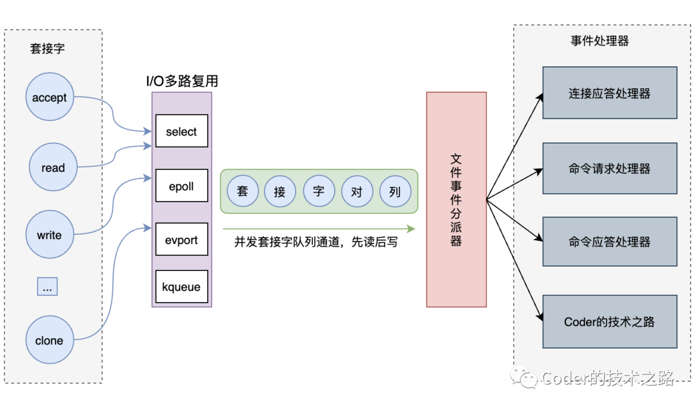
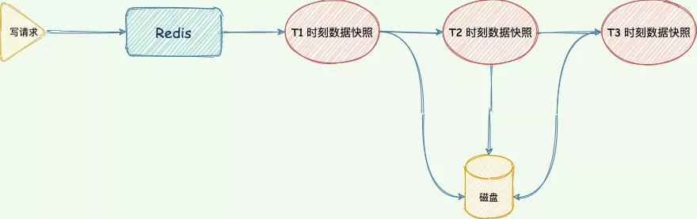
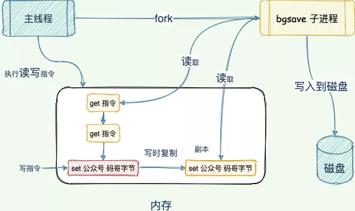
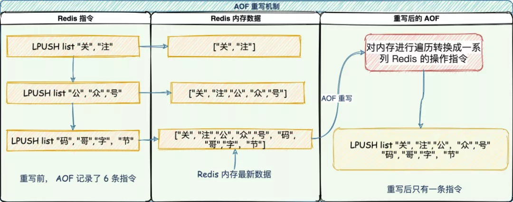

## Redis

### 单线程模型

>我们需要注意的是，Redis 的单线程指的是 **Redis 的网络 IO （6.x 版本后网络 IO 使用多线程）以及键值对指令读写是由一个线程来执行的。** 对于 Redis 的持久化、集群数据同步、异步删除等都是其他线程执行。

#### 为什么不用多线程

在运行每个任务之前，CPU 需要知道任务在何处加载并开始运行。也就是说，系统需要帮助它预先设置 CPU 寄存器和程序计数器，这称为 CPU 上下文。

**切换上下文时，我们需要完成一系列工作，这是非常消耗资源的操作。**

引入多线程开发，就需要使用同步原语来保护共享资源的并发读写，增加代码复杂度和调试难度。

#### 单线程好处

1. 不会因为线程创建导致的性能消耗；
2. 避免上下文切换引起的 CPU 消耗，没有多线程切换的开销；
3. 避免了线程之间的竞争问题，比如添加锁、释放锁、死锁等，不需要考虑各种锁问题。
4. 代码更清晰，处理逻辑简单。

### IO多路复用和事件驱动

Redis服务端，从整体上来看，其实是一个事件驱动的程序，所有的操作都以事件的方式来进行。

如图所示，Redis的事件驱动架构由套接字、I/O多路复用、文件事件分派器、事件处理器四个部分组成：

**套接字(Socket)**，是对网络中不同主机上的应用进程之间进行双向通信的端点的抽象。

**I/O多路复用**，通过监视多个描述符，当描述符就绪，则通知程序进行相应的操作，来帮助单个线程高效的处理多个连接请求。

Redis为每个IO多路复用函数都实现了相同的API，因此，底层实现是可以互换的。

Reids默认的IO多路复用机制是epoll，和select/poll等其他多路复用机制相比，epoll具有诸多优点：

| 模型   | 并发连接限制                                | 内存拷贝                     | 活跃连接感知                                |
| ------ | ------------------------------------------- | ---------------------------- | ------------------------------------------- |
| epoll  | 无最大并发连接数限制                        | 内存共享，无序内存拷贝       | 基于event callback方式，只感知活跃连接      |
| select | 受fd限制，32位机默认1024个/64位机默认2048个 | 将fd集合从用户态拷贝到内核态 | 只能感知有fd就绪，但无法定位，需要遍历+轮询 |
| poll   | 采用链表存贮fd，无最大并发连接数限制        | 同select                     | 同select，需遍历+轮询                       |

**事件驱动**，Redis设计的事件分为两种，文件事件和时间事件，文件事件是对套接字操作的抽象，而时间事件则是对一些定时操作的抽象。

*文件事件:*

- 客户端连接请求（AE_READABLE事件）
- 客户端命令请求（AE_READABLE事件）和事
- 服务端命令回复（AE_WRITABLE事件）

*时间事件:* 分为定时事件和周期性时间；redis的所有时间事件都存放在一个无序链表中，当时间事件执行器运行时，需要遍历链表以确保已经到达时间的事件被全部处理。

可以看到，Redis整个执行方案是通过高效的I/O多路复用事件驱动方式加上单线程内存操作来达到优秀的处理效率和极高的吞吐量。

### 持久化

Redis 的数据持久化使用了「RDB 数据快照」的方式来实现宕机快速恢复。但是 过于频繁的执行全量数据快照，有两个严重性能开销：

1. 频繁生成 RDB 文件写入磁盘，磁盘压力过大。会出现上一个 RDB 还未执行完，下一个又开始生成，陷入死循环。
2. fork 出 bgsave 子进程会阻塞主线程，主线程的内存越大，阻塞时间越长。

所以 Redis 还设计了 AOF 写后日志记录对内存进行修改的指令记录。

#### RDB

在 Redis 执行「写」指令过程中，内存数据会一直变化。所谓的内存快照，指的就是 Redis 内存中的数据在某一刻的状态数据。

好比时间定格在某一刻，当我们拍照的，通过照片就能把某一刻的瞬间画面完全记录下来。

Redis 跟这个类似，就是把某一刻的数据以文件的形式拍下来，写到磁盘上。这个快照文件叫做 **RDB 文件，RDB 就是 Redis DataBase 的缩写。**

在做数据恢复时，直接将 RDB 文件读入内存完成恢复。

> 在生成 RDB 期间，Redis 可以同时处理写请求么？

可以的，Redis 使用操作系统的多进程**写时复制技术 COW(Copy On Write)** 来实现快照持久化，保证数据一致性。

Redis 在持久化时会调用 glibc 的函数`fork`产生一个子进程，快照持久化完全交给子进程来处理，父进程继续处理客户端请求。

当主线程执行写指令修改数据的时候，这个数据就会复制一份副本， `bgsave` 子进程读取这个副本数据写到 RDB 文件。

这既保证了快照的完整性，也允许主线程同时对数据进行修改，避免了对正常业务的影响。

#### AOF

AOF 日志记录了自 Redis 实例创建以来所有的修改性指令序列，那么就可以通过对一个空的 Redis 实例顺序执行所有的指令，也就是「重放」，来恢复 Redis 当前实例的内存数据结构的状态。

Redis 提供的 AOF 配置项`appendfsync`写回策略直接决定 AOF 持久化功能的效率和安全性。

- **always**：同步写回，写指令执行完毕立马将 `aof_buf`缓冲区中的内容刷写到 AOF 文件。
- **everysec**：每秒写回，写指令执行完，日志只会写到 AOF 文件缓冲区，每隔一秒就把缓冲区内容同步到磁盘。
- **no：** 操作系统控制，写执行执行完毕，把日志写到 AOF 文件内存缓冲区，由操作系统决定何时刷写到磁盘。

没有两全其美的策略，我们需要在性能和可靠性上做一个取舍。

> 既然 RDB 有两个性能问题，那为何不用 AOF 即可？

AOF 写前日志，记录的是每个「写」指令操作。不会像 RDB 全量快照导致性能损耗，但是执行速度没有 RDB 快，同时日志文件过大也会造成性能问题。

所以，Redis 设计了一个杀手锏「AOF 重写机制」，Redis 提供了 `bgrewriteaof`指令用于对 AOF 日志进行瘦身。

其原理就是开辟一个子进程对内存进行遍历转换成一系列 Redis 的操作指令，序列化到一个新的 AOF 日志文件中。序列化完毕后再将操作期间发生的增量 AOF 日志追加到这个新的 AOF 日志文件中，追加完毕后就立即替代旧的 AOF 日志文件了，瘦身工作就完成了。

> 如何实现数据尽可能少丢失又能兼顾性能呢？

重启 Redis 时，我们很少使用 rdb 来恢复内存状态，因为会丢失大量数据。我们通常使用 AOF 日志重放，但是重放 AOF 日志性能相对 rdb 来说要慢很多，这样在 Redis 实例很大的情况下，启动需要花费很长的时间。

Redis 4.0 为了解决这个问题，带来了一个新的持久化选项——**混合持久化**。将 rdb 文件的内容和增量的 AOF 日志文件存在一起。这里的 AOF 日志不再是全量的日志，而是**自持久化开始到持久化结束的这段时间发生的增量 AOF 日志**，通常这部分 AOF 日志很小。

于是**在 Redis 重启的时候，可以先加载 rdb 的内容，然后再重放增量 AOF 日志就可以完全替代之前的 AOF 全量文件重放，重启效率因此大幅得到提升**。

