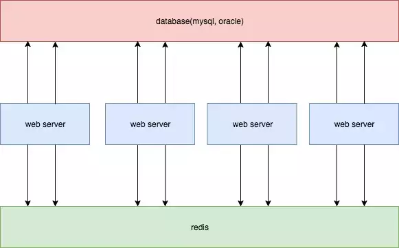
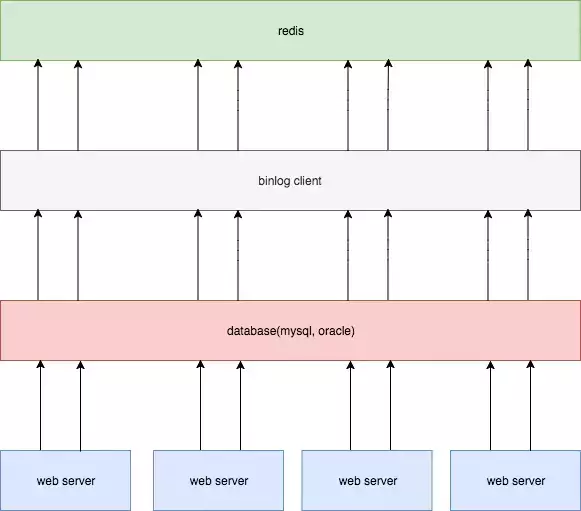

## 缓存一致性

### 方案一

通过key的过期时间，mysql更新时，redis不更新。

这种方式实现简单，但不一致的时间会很长。如果读请求非常频繁，且过期时间比较长，则会产生很多长期的脏数据。

**优点：**

- 开发成本低，易于实现；
- 管理成本低，出问题的概率会比较小。

**不足：**

- 完全依赖过期时间，时间太短容易缓存频繁失效，太长容易有长时间更新延迟（不一致）

### 方案二

在方案一的基础上扩展，通过key的过期时间兜底，并且，在更新mysql时，同时更新redis。

**优点：**

- 相对方案一，更新延迟更小。

**不足：**

- 如果更新mysql成功，更新redis却失败，就退化到了方案一；
- 在高并发场景，业务server需要和mysql,redis同时进行连接。这样是损耗双倍的连接资源，容易造成连接数过多的问题。

### 方案三

针对方案二的同步写redis进行优化，增加消息队列，将redis更新操作交给kafka，由消息队列保证可靠性，再搭建一个消费服务，来异步更新redis。

**优点：**

- 消息队列可以用一个句柄，很多消息队列客户端还支持本地缓存发送，有效解决了方案二连接数过多的问题；
- 使用消息队列，实现了逻辑上的解耦；
- 消息队列本身具有可靠性，通过手动提交等手段，可以至少一次消费到redis。

**不足：**

- 依旧解决不了时序性问题，如果多台业务服务器分别处理针对同一行数据的两条请求，举个栗子，a = 1；a = 5; 如果mysql中是第一条先执行，而进入kafka的顺序是第二条先执行，那么数据就会产生不一致。
- 引入了消息队列，同时要增加服务消费消息，成本较高，还有重复消费的风险。

### 方案四

通过订阅binlog来更新redis，把我们搭建的消费服务，作为mysql的一个slave，订阅binlog，解析出更新内容，再更新到redis。

**优点：**

- 在mysql压力不大情况下，延迟较低；
- 和业务完全解耦；
- 解决了时序性问题。

**缺点：**

- 要单独搭建一个同步服务，并且引入binlog同步机制，成本较大。

### 总结

**方案选型**

首先确认产品上对延迟性的要求，如果要求极高，且数据有可能变化，别用缓存。

通常来说，方案1就够了，笔者咨询过4，5个团队，基本都是用方案1，因为能用缓存方案，通常是读多写少场景，同时业务上对延迟具有一定的包容性。方案1没有开发成本，其实比较实用。

如果想增加更新时的即时性，就选择方案2，不过没必要做重试保证之类的。

方案3，方案4针对于对延时要求比较高业务，一个是推模式，一个是拉模式，而方案4具备更强的可靠性，既然都愿意花功夫做处理消息的逻辑，不如一步到位，用方案4。

### 结论

一般情况，方案1够用。若延时要求高，直接选择方案4。如果是面试场景，从简单讲到复杂，面试官会一步一步追问，咱们就一点点推导，宾主尽欢。